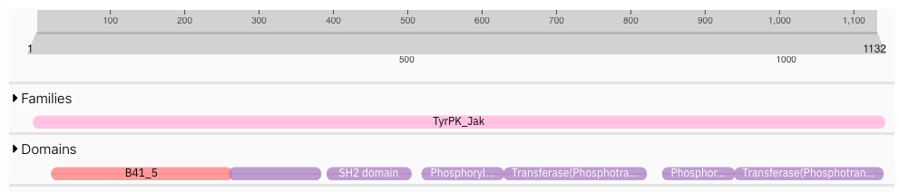
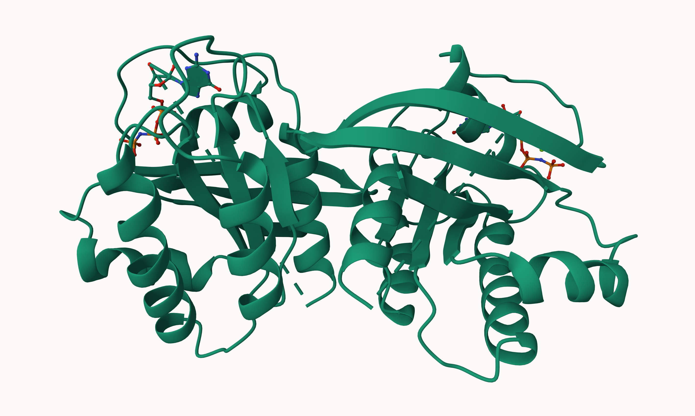
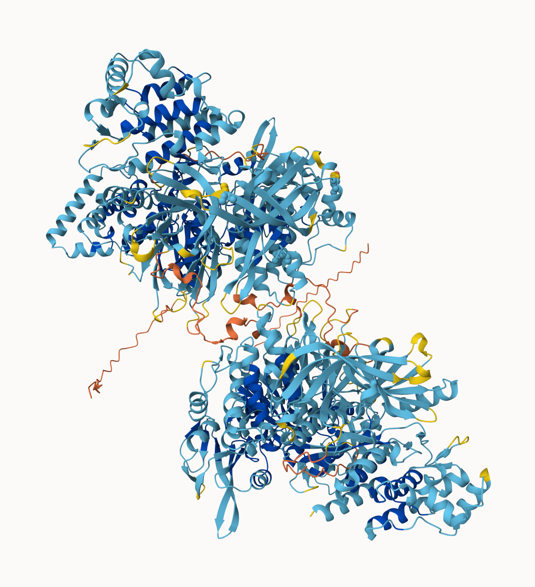

# Class 19: Mini Project Cancer Mutation Analysis
Katherine Quach (A18541014)

- [Background](#background)
- [Optional Extension](#optional-extension)

## Background

To identify somatic mutations in a tumor, DNA from the tumor is
sequenced and compared to DNA from normal tissue in the same individual
using variant calling algorithms.

Comparison of tumor sequences to those from normal tissue (rather than
‘the human genome’) is important to ensure that the detected differences
are not germline mutations.

To identify which of the somatic mutations leads to the production of
aberrant proteins, the location of the mutation in the genome is
inspected to identify non-synonymous mutations (i.e. those that fall
into protein coding regions and change the encoded amino acid).

I downloaded my sequence from the class website and moved it to my
working directory:

> Q1. What protein do these sequences correspond to? (Give both full
> gene/protein name and official symbol).

From a **BLASTp** search against human refseq I see that it is:

- Official Symbol: JAK2
- Official Full Name: Janus kinase 2

``` r
library(bio3d)

seq <- read.fasta("A18541014_mutant_seq.fa")
seq
```

                   1        .         .         .         .         .         60 
    wt_healthy     MGMACLTMTEMEGTSTSSIYQNGDISGNANSMKQIDPVLQVYLYHSLGKSEADYLTFPSG
    mutant_tumor   MGMACLTMTEMEGTSTSSIYQNGDISGNANSMKQIDPVLQVYLYHSLGKSEADYLTFPSG
                   ************************************************************ 
                   1        .         .         .         .         .         60 

                  61        .         .         .         .         .         120 
    wt_healthy     EYVAEEICIAASKACGITPVYHNMFALMSETERIWYPPNHVFHIDESTRHNVLYRIRFYF
    mutant_tumor   EYVAEEICIAASKACGITPVYHNMFALMSETERIWYPPNHVFHIDESTRHNVLYRIRFYF
                   ************************************************************ 
                  61        .         .         .         .         .         120 

                 121        .         .         .         .         .         180 
    wt_healthy     PRWYCSGSNRAYRHGISRGAEAPLLDDFVMSYLFAQWRHDFVHGWIKVPVTHETQEECLG
    mutant_tumor   PRWYCSGSNRAYRHGISRGAEAPLLDDFVMSYLFAQWRHDFVHGWIKVPVTHETQEECLG
                   ************************************************************ 
                 121        .         .         .         .         .         180 

                 181        .         .         .         .         .         240 
    wt_healthy     MAVLDMMRIAKENDQTPLAIYNSISYKTFLPKCIRAKIQDYHILTRKRIRYRFRRFIQQF
    mutant_tumor   MAVLDMMRIAKENDQTPLAIYNSISYKTFLPKCIRAKIQDYHILTRKRIRYRFRRFIQQF
                   ************************************************************ 
                 181        .         .         .         .         .         240 

                 241        .         .         .         .         .         300 
    wt_healthy     SQCKATARNLKLKYLINLETLQSAFYTEKFEVKEPGSGPSGEEIFATIIITGNGGIQWSR
    mutant_tumor   SQCKATARNLKLKYLINLETLQSAFYTEKFEVKEPGSGPSGEEIFATIIITGNGGIQWSR
                   ************************************************************ 
                 241        .         .         .         .         .         300 

                 301        .         .         .         .         .         360 
    wt_healthy     GKHKESETLTEQDLQLYCDFPNIIDVSIKQANQEGSNESRVVTIHKQDGKNLEIELSSLR
    mutant_tumor   GKHKESETLTEQDLQLYCDFPNIIDVSIKQANQEGSNESRVVTIHKQDGKNLEIELSSLR
                   ************************************************************ 
                 301        .         .         .         .         .         360 

                 361        .         .         .         .         .         420 
    wt_healthy     EALSFVSLIDGYYRLTADAHHYLCKEVAPPAVLENIQSNCHGPISMDFAISKLKKAGNQT
    mutant_tumor   EALSFVSLIDGYYRLTADAHHYLCKEVAPPAVLENIQSNCHGPISMDFAISKLKKAGNQT
                   ************************************************************ 
                 361        .         .         .         .         .         420 

                 421        .         .         .         .         .         480 
    wt_healthy     GLYVLRCSPKDFNKYFLTFAVERENVIEYKHCLITKNENEEYNLSGTKKNFSSLKDLLNC
    mutant_tumor   GLYVLRCSPKDFNKYFLTFAVERENVIEYKHCLITKNENEEYNLSGTKKNFSSLKDLLNC
                   ************************************************************ 
                 421        .         .         .         .         .         480 

                 481        .         .         .         .         .         540 
    wt_healthy     YQMETVRSDNIIFQFTKCCPPKPKDKSNLLVFRTNGVSDVPTSPTLQRPTHMNQMVFHKI
    mutant_tumor   YQMETVRSDNIIFQFTKCCPPKPKDKSNLLVFRTNGVSDVPTSPTLQRPTHMNQMVFHKI
                   ************************************************************ 
                 481        .         .         .         .         .         540 

                 541        .         .         .         .         .         600 
    wt_healthy     RNEDLIFNESLGQGTFTKIFKGVRREVGDYGQLHETEVLLKVLDKAHRNYSESFFEAASM
    mutant_tumor   RNEDLIFNESLGQGTFTKIFKGVRVEVGDYGQLHETEVLLKVLDKAHRNYSESFFEAASM
                   ************************ *********************************** 
                 541        .         .         .         .         .         600 

                 601        .         .         .         .         .         660 
    wt_healthy     MSKLSHKHLVLNYGVCVCGDENILVQEFVKFGSLDTYLKKNKNCINILWKLEVAKQLAWA
    mutant_tumor   MSKLSHKHLVLNYGVCVCGDENILVQEFVKFGELDTYLKKNKNCINILWKLEVAKQLAWA
                   ******************************** *************************** 
                 601        .         .         .         .         .         660 

                 661        .         .         .         .         .         720 
    wt_healthy     MHFLEENTLIHGNVCAKNILLIREEDRKTGNPPFIKLSDPGISITVLPKDILQERIPWVP
    mutant_tumor   MHFLEENTLIHGNVCAKNILLIREEDRKTGNPPFIKLSDPGISITVLRKDILQERIPWVP
                   *********************************************** ************ 
                 661        .         .         .         .         .         720 

                 721        .         .         .         .         .         780 
    wt_healthy     PECIENPKNLNLATDKWSFGTTLWEICSGGDKPLSALDSQRKLQFYEDRHQLPAPKWAEL
    mutant_tumor   PECIENPKNLNLATDKWSFGTTLWEICSGGDKPLSALDSQRKLQFYEDRHQLPAPKWAEL
                   ************************************************************ 
                 721        .         .         .         .         .         780 

                 781        .         .         .         .         .         840 
    wt_healthy     ANLINNCMDYEPDFRPSFRAIIRDLNSLFTPDYELLTENDMLPNMRIGALGFSGAFEDRD
    mutant_tumor   ANLINNCMDYEPDFRPSFRAIIRDLNSLFTPDYELLTENDMLPNMRIGALGFSGAFEDRD
                   ************************************************************ 
                 781        .         .         .         .         .         840 

                 841        .         .         .         .         .         900 
    wt_healthy     PTQFEERHLKFLQQLGKGNFGSVEMCRYDPLQDNTGEVVAVKKLQHSTEEHLRDFEREIE
    mutant_tumor   PTQFEERHLKFLQQLGKGNFGSVEMCRYDPLQDNTGEVVAVKKLQHSTEEHLRDFEREIE
                   ************************************************************ 
                 841        .         .         .         .         .         900 

                 901        .         .         .         .         .         960 
    wt_healthy     ILKSLQHDNIVKYKGVCYSAGRRNLKLIMEYLPYGSLRDYLQKHKERIDHIKLLQYTSQI
    mutant_tumor   ILKSLQHDNIVKYKGVCYSAGRRNLKLIMEYLPYGSLRDYLQKHKERIDHIKLLQYTSQI
                   ************************************************************ 
                 901        .         .         .         .         .         960 

                 961        .         .         .         .         .         1020 
    wt_healthy     CKGMEYLGTKRYIHRDLATRNILVENENRVKIGDFGLTKVLPQDKEYYKVKEPGESPIFW
    mutant_tumor   CKGMEYLGTKRYIHRDLATRNILVENENRVKIGDFGLTKVLPQDKEYYKVKEPGESPIFW
                   ************************************************************ 
                 961        .         .         .         .         .         1020 

                1021        .         .         .         .         .         1080 
    wt_healthy     YAPESLTESKFSVASDVWSFGVVLYELFTYIEKSKSPPAEFMRMIGNDKQGQMIVFHLIE
    mutant_tumor   YAPESLTESKFSVASDVWSFGVVLYELFTYIEKSKSPPAEFMRMIGNDKQGQMIVFHLIE
                   ************************************************************ 
                1021        .         .         .         .         .         1080 

                1081        .         .         .         .         . 1132 
    wt_healthy     LLKNNGRLPRPDGCPDEIYMIMTECWNNNVNQRPSFRDLALRVDQIRDNMAG
    mutant_tumor   LLKNNGRLPRPDGCPDEIYMIMTECWNNNVNQRPSFRDLALRVDQIRDNMAG
                   **************************************************** 
                1081        .         .         .         .         . 1132 

    Call:
      read.fasta(file = "A18541014_mutant_seq.fa")

    Class:
      fasta

    Alignment dimensions:
      2 sequence rows; 1132 position columns (1132 non-gap, 0 gap) 

    + attr: id, ali, call

> Q2. What are the tumor specific mutations in this particular case
> (e.g. A130V)?

We could score residue conservation then find the non 1.0 scoring
position. These will be the mutation positions:

``` r
conserv(seq)
```

       [1]  1.0  1.0  1.0  1.0  1.0  1.0  1.0  1.0  1.0  1.0  1.0  1.0  1.0  1.0
      [15]  1.0  1.0  1.0  1.0  1.0  1.0  1.0  1.0  1.0  1.0  1.0  1.0  1.0  1.0
      [29]  1.0  1.0  1.0  1.0  1.0  1.0  1.0  1.0  1.0  1.0  1.0  1.0  1.0  1.0
      [43]  1.0  1.0  1.0  1.0  1.0  1.0  1.0  1.0  1.0  1.0  1.0  1.0  1.0  1.0
      [57]  1.0  1.0  1.0  1.0  1.0  1.0  1.0  1.0  1.0  1.0  1.0  1.0  1.0  1.0
      [71]  1.0  1.0  1.0  1.0  1.0  1.0  1.0  1.0  1.0  1.0  1.0  1.0  1.0  1.0
      [85]  1.0  1.0  1.0  1.0  1.0  1.0  1.0  1.0  1.0  1.0  1.0  1.0  1.0  1.0
      [99]  1.0  1.0  1.0  1.0  1.0  1.0  1.0  1.0  1.0  1.0  1.0  1.0  1.0  1.0
     [113]  1.0  1.0  1.0  1.0  1.0  1.0  1.0  1.0  1.0  1.0  1.0  1.0  1.0  1.0
     [127]  1.0  1.0  1.0  1.0  1.0  1.0  1.0  1.0  1.0  1.0  1.0  1.0  1.0  1.0
     [141]  1.0  1.0  1.0  1.0  1.0  1.0  1.0  1.0  1.0  1.0  1.0  1.0  1.0  1.0
     [155]  1.0  1.0  1.0  1.0  1.0  1.0  1.0  1.0  1.0  1.0  1.0  1.0  1.0  1.0
     [169]  1.0  1.0  1.0  1.0  1.0  1.0  1.0  1.0  1.0  1.0  1.0  1.0  1.0  1.0
     [183]  1.0  1.0  1.0  1.0  1.0  1.0  1.0  1.0  1.0  1.0  1.0  1.0  1.0  1.0
     [197]  1.0  1.0  1.0  1.0  1.0  1.0  1.0  1.0  1.0  1.0  1.0  1.0  1.0  1.0
     [211]  1.0  1.0  1.0  1.0  1.0  1.0  1.0  1.0  1.0  1.0  1.0  1.0  1.0  1.0
     [225]  1.0  1.0  1.0  1.0  1.0  1.0  1.0  1.0  1.0  1.0  1.0  1.0  1.0  1.0
     [239]  1.0  1.0  1.0  1.0  1.0  1.0  1.0  1.0  1.0  1.0  1.0  1.0  1.0  1.0
     [253]  1.0  1.0  1.0  1.0  1.0  1.0  1.0  1.0  1.0  1.0  1.0  1.0  1.0  1.0
     [267]  1.0  1.0  1.0  1.0  1.0  1.0  1.0  1.0  1.0  1.0  1.0  1.0  1.0  1.0
     [281]  1.0  1.0  1.0  1.0  1.0  1.0  1.0  1.0  1.0  1.0  1.0  1.0  1.0  1.0
     [295]  1.0  1.0  1.0  1.0  1.0  1.0  1.0  1.0  1.0  1.0  1.0  1.0  1.0  1.0
     [309]  1.0  1.0  1.0  1.0  1.0  1.0  1.0  1.0  1.0  1.0  1.0  1.0  1.0  1.0
     [323]  1.0  1.0  1.0  1.0  1.0  1.0  1.0  1.0  1.0  1.0  1.0  1.0  1.0  1.0
     [337]  1.0  1.0  1.0  1.0  1.0  1.0  1.0  1.0  1.0  1.0  1.0  1.0  1.0  1.0
     [351]  1.0  1.0  1.0  1.0  1.0  1.0  1.0  1.0  1.0  1.0  1.0  1.0  1.0  1.0
     [365]  1.0  1.0  1.0  1.0  1.0  1.0  1.0  1.0  1.0  1.0  1.0  1.0  1.0  1.0
     [379]  1.0  1.0  1.0  1.0  1.0  1.0  1.0  1.0  1.0  1.0  1.0  1.0  1.0  1.0
     [393]  1.0  1.0  1.0  1.0  1.0  1.0  1.0  1.0  1.0  1.0  1.0  1.0  1.0  1.0
     [407]  1.0  1.0  1.0  1.0  1.0  1.0  1.0  1.0  1.0  1.0  1.0  1.0  1.0  1.0
     [421]  1.0  1.0  1.0  1.0  1.0  1.0  1.0  1.0  1.0  1.0  1.0  1.0  1.0  1.0
     [435]  1.0  1.0  1.0  1.0  1.0  1.0  1.0  1.0  1.0  1.0  1.0  1.0  1.0  1.0
     [449]  1.0  1.0  1.0  1.0  1.0  1.0  1.0  1.0  1.0  1.0  1.0  1.0  1.0  1.0
     [463]  1.0  1.0  1.0  1.0  1.0  1.0  1.0  1.0  1.0  1.0  1.0  1.0  1.0  1.0
     [477]  1.0  1.0  1.0  1.0  1.0  1.0  1.0  1.0  1.0  1.0  1.0  1.0  1.0  1.0
     [491]  1.0  1.0  1.0  1.0  1.0  1.0  1.0  1.0  1.0  1.0  1.0  1.0  1.0  1.0
     [505]  1.0  1.0  1.0  1.0  1.0  1.0  1.0  1.0  1.0  1.0  1.0  1.0  1.0  1.0
     [519]  1.0  1.0  1.0  1.0  1.0  1.0  1.0  1.0  1.0  1.0  1.0  1.0  1.0  1.0
     [533]  1.0  1.0  1.0  1.0  1.0  1.0  1.0  1.0  1.0  1.0  1.0  1.0  1.0  1.0
     [547]  1.0  1.0  1.0  1.0  1.0  1.0  1.0  1.0  1.0  1.0  1.0  1.0  1.0  1.0
     [561]  1.0  1.0  1.0  1.0 -0.3  1.0  1.0  1.0  1.0  1.0  1.0  1.0  1.0  1.0
     [575]  1.0  1.0  1.0  1.0  1.0  1.0  1.0  1.0  1.0  1.0  1.0  1.0  1.0  1.0
     [589]  1.0  1.0  1.0  1.0  1.0  1.0  1.0  1.0  1.0  1.0  1.0  1.0  1.0  1.0
     [603]  1.0  1.0  1.0  1.0  1.0  1.0  1.0  1.0  1.0  1.0  1.0  1.0  1.0  1.0
     [617]  1.0  1.0  1.0  1.0  1.0  1.0  1.0  1.0  1.0  1.0  1.0  1.0  1.0  1.0
     [631]  1.0  1.0 -0.1  1.0  1.0  1.0  1.0  1.0  1.0  1.0  1.0  1.0  1.0  1.0
     [645]  1.0  1.0  1.0  1.0  1.0  1.0  1.0  1.0  1.0  1.0  1.0  1.0  1.0  1.0
     [659]  1.0  1.0  1.0  1.0  1.0  1.0  1.0  1.0  1.0  1.0  1.0  1.0  1.0  1.0
     [673]  1.0  1.0  1.0  1.0  1.0  1.0  1.0  1.0  1.0  1.0  1.0  1.0  1.0  1.0
     [687]  1.0  1.0  1.0  1.0  1.0  1.0  1.0  1.0  1.0  1.0  1.0  1.0  1.0  1.0
     [701]  1.0  1.0  1.0  1.0  1.0  1.0  1.0 -0.1  1.0  1.0  1.0  1.0  1.0  1.0
     [715]  1.0  1.0  1.0  1.0  1.0  1.0  1.0  1.0  1.0  1.0  1.0  1.0  1.0  1.0
     [729]  1.0  1.0  1.0  1.0  1.0  1.0  1.0  1.0  1.0  1.0  1.0  1.0  1.0  1.0
     [743]  1.0  1.0  1.0  1.0  1.0  1.0  1.0  1.0  1.0  1.0  1.0  1.0  1.0  1.0
     [757]  1.0  1.0  1.0  1.0  1.0  1.0  1.0  1.0  1.0  1.0  1.0  1.0  1.0  1.0
     [771]  1.0  1.0  1.0  1.0  1.0  1.0  1.0  1.0  1.0  1.0  1.0  1.0  1.0  1.0
     [785]  1.0  1.0  1.0  1.0  1.0  1.0  1.0  1.0  1.0  1.0  1.0  1.0  1.0  1.0
     [799]  1.0  1.0  1.0  1.0  1.0  1.0  1.0  1.0  1.0  1.0  1.0  1.0  1.0  1.0
     [813]  1.0  1.0  1.0  1.0  1.0  1.0  1.0  1.0  1.0  1.0  1.0  1.0  1.0  1.0
     [827]  1.0  1.0  1.0  1.0  1.0  1.0  1.0  1.0  1.0  1.0  1.0  1.0  1.0  1.0
     [841]  1.0  1.0  1.0  1.0  1.0  1.0  1.0  1.0  1.0  1.0  1.0  1.0  1.0  1.0
     [855]  1.0  1.0  1.0  1.0  1.0  1.0  1.0  1.0  1.0  1.0  1.0  1.0  1.0  1.0
     [869]  1.0  1.0  1.0  1.0  1.0  1.0  1.0  1.0  1.0  1.0  1.0  1.0  1.0  1.0
     [883]  1.0  1.0  1.0  1.0  1.0  1.0  1.0  1.0  1.0  1.0  1.0  1.0  1.0  1.0
     [897]  1.0  1.0  1.0  1.0  1.0  1.0  1.0  1.0  1.0  1.0  1.0  1.0  1.0  1.0
     [911]  1.0  1.0  1.0  1.0  1.0  1.0  1.0  1.0  1.0  1.0  1.0  1.0  1.0  1.0
     [925]  1.0  1.0  1.0  1.0  1.0  1.0  1.0  1.0  1.0  1.0  1.0  1.0  1.0  1.0
     [939]  1.0  1.0  1.0  1.0  1.0  1.0  1.0  1.0  1.0  1.0  1.0  1.0  1.0  1.0
     [953]  1.0  1.0  1.0  1.0  1.0  1.0  1.0  1.0  1.0  1.0  1.0  1.0  1.0  1.0
     [967]  1.0  1.0  1.0  1.0  1.0  1.0  1.0  1.0  1.0  1.0  1.0  1.0  1.0  1.0
     [981]  1.0  1.0  1.0  1.0  1.0  1.0  1.0  1.0  1.0  1.0  1.0  1.0  1.0  1.0
     [995]  1.0  1.0  1.0  1.0  1.0  1.0  1.0  1.0  1.0  1.0  1.0  1.0  1.0  1.0
    [1009]  1.0  1.0  1.0  1.0  1.0  1.0  1.0  1.0  1.0  1.0  1.0  1.0  1.0  1.0
    [1023]  1.0  1.0  1.0  1.0  1.0  1.0  1.0  1.0  1.0  1.0  1.0  1.0  1.0  1.0
    [1037]  1.0  1.0  1.0  1.0  1.0  1.0  1.0  1.0  1.0  1.0  1.0  1.0  1.0  1.0
    [1051]  1.0  1.0  1.0  1.0  1.0  1.0  1.0  1.0  1.0  1.0  1.0  1.0  1.0  1.0
    [1065]  1.0  1.0  1.0  1.0  1.0  1.0  1.0  1.0  1.0  1.0  1.0  1.0  1.0  1.0
    [1079]  1.0  1.0  1.0  1.0  1.0  1.0  1.0  1.0  1.0  1.0  1.0  1.0  1.0  1.0
    [1093]  1.0  1.0  1.0  1.0  1.0  1.0  1.0  1.0  1.0  1.0  1.0  1.0  1.0  1.0
    [1107]  1.0  1.0  1.0  1.0  1.0  1.0  1.0  1.0  1.0  1.0  1.0  1.0  1.0  1.0
    [1121]  1.0  1.0  1.0  1.0  1.0  1.0  1.0  1.0  1.0  1.0  1.0  1.0

``` r
mutation.sites <- which(conserv(seq) < 1)
```

``` r
paste(seq$ali[1, mutation.sites],
mutation.sites,
seq$ali[2, mutation.sites])
```

    [1] "R 565 V" "S 633 E" "P 708 R"

> Q3. Do your mutations cluster to any particular domain and if so give
> the name and PFAM id of this domain? Alternately note whether your
> protein is single domain and provide it’s PFAM id/accession and name
> (e.g. PF00613 and PI3Ka).

Domains from InterPro search:
(https://www.ebi.ac.uk/interpro/result/InterProScan/iprscan5-R20260310-182219-0230-34038458-p1m/internal-1773166935369-54-1/)

PFAM: 

Description & Coordinates: “R 565 V” - Phosphorylase Kinase; domain 1
(521-628) and Transferase(Phosphotransferase) domain 1 (629-816)

“S 633 E” - Transferase(Phosphotransferase) domain 1 (629-816)

“P 708 R” - Transferase(Phosphotransferase) domain 1 (629-816)

Use this website for Q4-5
(https://portal.gdc.cancer.gov/genes/ENSG00000096968)

> Q4. Using the NCI-GDC list the observed top 2 missense mutations in
> this protein (amino acid substitutions)?

JAK2 R683G - chr9:g.5078360A\>G JAK2 T875N - chr9:g.5089726C\>A

> Q5. What two TCGA projects have the most cases affected by mutations
> of this gene? (Give the TCGA “code” and “Project Name” for example
> “TCGA-BRCA” and “Breast Invasive Carcinoma”).

TCGA-UCEC - Uterine Corpus Endometrial Carcinoma TARGET-AML - Acute
Myeloid Leukemia

> Q6. List one RCSB PDB identifier with 100% identity to the wt_healthy
> sequence and detail the percent coverage of your query sequence for
> this known structure? Alternately, provide the most similar in
> sequence PDB structure along with it’s percent identity, coverage and
> E-value. Does this structure “cover” (i.e. include or span the amino
> acid residue positions) of your previously identified tumor specific
> mutations?

**Chain A, Tyrosine-protein kinase JAK2 \[Homo sapiens\]** - Query
Coverage: **42%** - Percent Identity: **100.00%** - E-value: **0.0**



## Optional Extension

> Q7. Using AlphaFold notebook generate a structural model using the
> default parameters for your mutant sequence.



> Q8. Considering only your mutations in high quality structure regions
> (with a pLDDT score \> 70) are any of the mutations on the surface of
> the protein and hence have a potential to interfere with
> protein-protein interaction events? List these mutations below
> (e.g. A130V)
