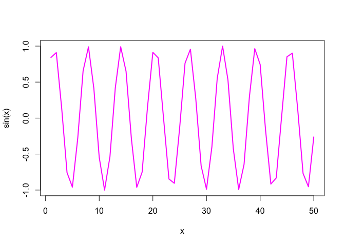

# Class 4: Bioinformatics data analysis with R
Katherine Quach (A18541014)

``` r
x <- 1:50 
plot(x, sin(x))
```


``` r
plot(x, sin(x), typ="l", col="magenta", lwd=2)
```



``` r
log(10)
```

    [1] 2.302585

``` r
log(10, base=10)
```

    [1] 1
