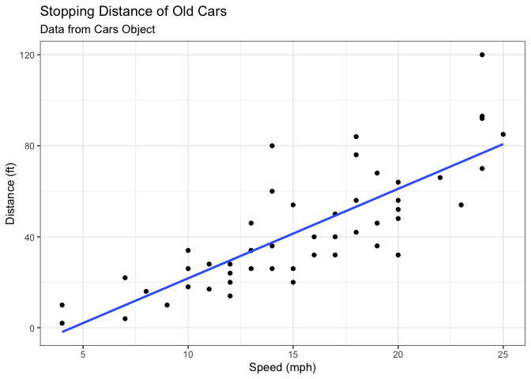
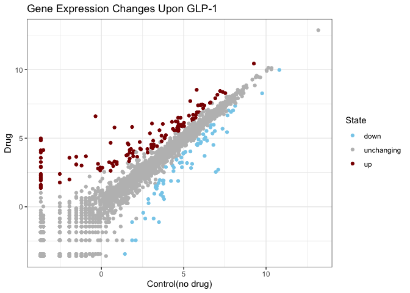
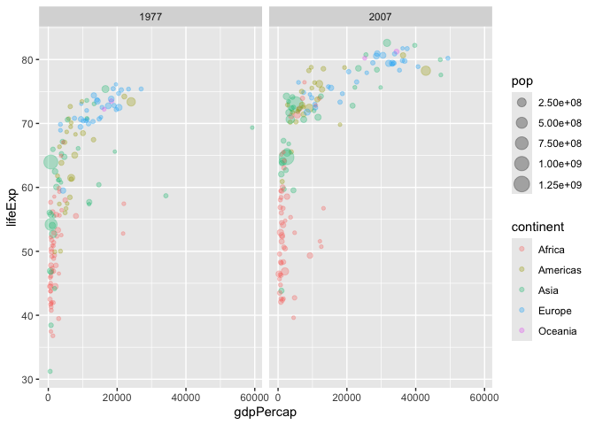
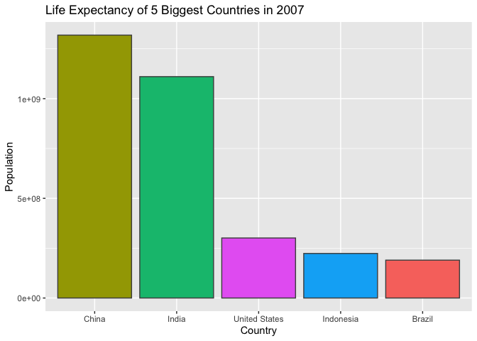

# Class 05: Data Visualization with GGPLOT
Katherine Quach (A18541014)

- [Background](#background)
- [Gene expression plot](#gene-expression-plot)
- [Let’s go further](#lets-go-further)
- [Custom plots](#custom-plots)
- [Bar Charts](#bar-charts)

## Background

There are multiple ways to make figures in R, and some of these include
“Base R” graphics (e.g. `plot()`) and many add-on packages like
**ggplot2**

For instance, we will make the same plot with:

``` r
head(cars)
```

      speed dist
    1     4    2
    2     4   10
    3     7    4
    4     7   22
    5     8   16
    6     9   10

``` r
plot(cars)
```


First we need to install necessary package with the command
`install.packages()`

> **N.B.** we never run and install cmd in a quarto code chunk or it
> will reinstall packages AGAIN, and multiple times (not what we want!)

Every time we want to use one of these “add-on” packages we need to load
it up in R with the `library()` function

``` r
library(ggplot2)
```

``` r
ggplot(cars)
```


Every ggplot needs 3 things:

- The **data**, the stuff you want plotted
- The **aes**thetics, how the data map to the plot
- The **geom**etry, the type of plot

``` r
ggplot(cars) + 
  aes(x = speed, y = dist) + 
  geom_point()
```


Let’s add a line to show the relationship between two entities and then
render it out!

``` r
p <- ggplot(cars) +
  aes(x = speed, y = dist) +
  geom_point() +
  geom_smooth(method = "lm", se = FALSE) + 
  labs(title = "Stopping Distance of Old Cars",
       subtitles = "Data from Cars Object",
       x = "Speed (mph)", y = "Distance (ft)")
p + theme_bw()
```

    Ignoring unknown labels:
    • subtitles : "Data from Cars Object"
    `geom_smooth()` using formula = 'y ~ x'



## Gene expression plot

We can read the input data from the class website

``` r
url <- "https://bioboot.github.io/bimm143_S20/class-material/up_down_expression.txt"
genes <- read.delim(url)
head(genes)
```

            Gene Condition1 Condition2      State
    1      A4GNT -3.6808610 -3.4401355 unchanging
    2       AAAS  4.5479580  4.3864126 unchanging
    3      AASDH  3.7190695  3.4787276 unchanging
    4       AATF  5.0784720  5.0151916 unchanging
    5       AATK  0.4711421  0.5598642 unchanging
    6 AB015752.4 -3.6808610 -3.5921390 unchanging

Let’s plot our first version

``` r
ggplot(genes) + 
  aes(Condition1, Condition2) +
  geom_point()
```


``` r
table(genes$State)
```


          down unchanging         up 
            72       4997        127 

Let’s plot version 2 by coloring by `State` so we can see up and down
significant genes compared to the unchanging genes

``` r
ggplot(genes) + 
  aes(Condition1, Condition2, col = State) +
  geom_point()
```


Let’s plot version 3 by modifying colors to our liking

``` r
ggplot(genes) + 
  aes(Condition1, Condition2, col = State) +
  geom_point() + 
  scale_colour_manual(values = c("skyblue","gray","darkred"))+
  labs(x = "Control(no drug)", y = "Drug", title = "Gene Expression Changes Upon GLP-1") + theme_bw()
```



## Let’s go further

``` r
url <- "https://raw.githubusercontent.com/jennybc/gapminder/master/inst/extdata/gapminder.tsv"

gapminder <- read.delim(url)
```

``` r
head(gapminder, 3)
```

          country continent year lifeExp      pop gdpPercap
    1 Afghanistan      Asia 1952  28.801  8425333  779.4453
    2 Afghanistan      Asia 1957  30.332  9240934  820.8530
    3 Afghanistan      Asia 1962  31.997 10267083  853.1007

``` r
ggplot(data = gapminder) +
  aes(x = gdpPercap, y = lifeExp, col = continent) +
  geom_point(alpha = 0.3)
```


Let’s “facet” (i.e. make a separate plot) by continent

``` r
ggplot(data = gapminder) +
  aes(x = gdpPercap, y = lifeExp, col = continent) +
  geom_point(alpha = 0.3) + 
  facet_wrap(~continent)
```


## Custom plots

How big is this gapminder dataset?

``` r
nrow(gapminder)
```

    [1] 1704

``` r
ncol(gapminder)
```

    [1] 6

To filter down a subset of the data, let’s use the **dplyr** package

First I need to install it, then load it `install.packages("dplyr")` and
then `library("dplyr")`

``` r
library(dplyr)
```


    Attaching package: 'dplyr'

    The following objects are masked from 'package:stats':

        filter, lag

    The following objects are masked from 'package:base':

        intersect, setdiff, setequal, union

``` r
gapminder_2007 <- filter(gapminder, year == 2007)
head(gapminder_2007)
```

          country continent year lifeExp      pop  gdpPercap
    1 Afghanistan      Asia 2007  43.828 31889923   974.5803
    2     Albania    Europe 2007  76.423  3600523  5937.0295
    3     Algeria    Africa 2007  72.301 33333216  6223.3675
    4      Angola    Africa 2007  42.731 12420476  4797.2313
    5   Argentina  Americas 2007  75.320 40301927 12779.3796
    6   Australia   Oceania 2007  81.235 20434176 34435.3674

``` r
filter(gapminder_2007, country == "Ireland")
```

      country continent year lifeExp     pop gdpPercap
    1 Ireland    Europe 2007  78.885 4109086     40676

``` r
filter(gapminder, year == 2007, country == "Ireland")
```

      country continent year lifeExp     pop gdpPercap
    1 Ireland    Europe 2007  78.885 4109086     40676

``` r
filter(gapminder, year == 2007, country == "United States")
```

            country continent year lifeExp       pop gdpPercap
    1 United States  Americas 2007  78.242 301139947  42951.65

> Q. Make a plot comparing 1977 and 2007 for all countries

``` r
input <- filter(gapminder, year %in% c(1977,2007))
ggplot(data = input) +
  aes(x = gdpPercap, y = lifeExp, col = continent, size = pop) +
  geom_point(alpha = 0.3) + 
  facet_wrap(~year)
```



## Bar Charts

``` r
gapminder_top5 <- gapminder %>% 
  filter(year == 2007) %>% 
  arrange(desc(pop)) %>% 
  top_n(5, pop)
```

> Q. Create a bar chart showing the life expectancy of the five biggest
> countries by population in 2007

``` r
ggplot(gapminder_top5) +
  aes(x = reorder(country, -pop), y = pop, fill = country) +
  geom_col(col = "gray30") +
  guides(fill = "none") + labs(x = "Country", y = "Population", title = "Life Expectancy of 5 Biggest Countries in 2007")
```


