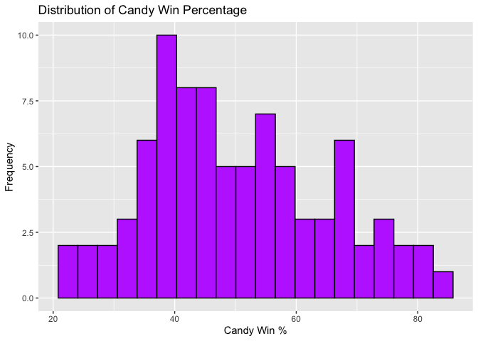
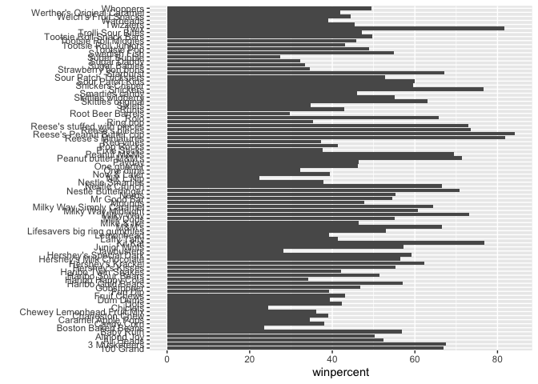
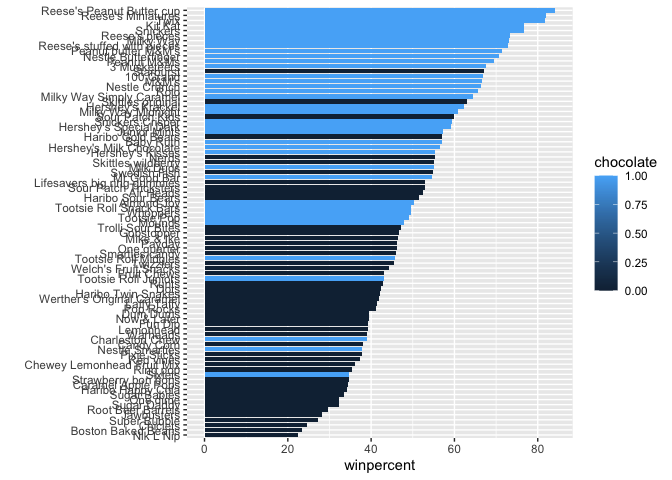
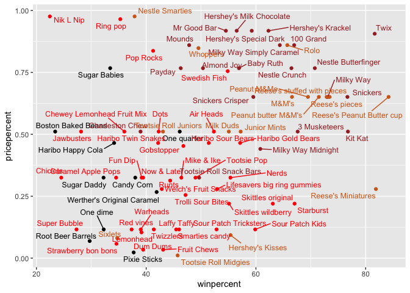
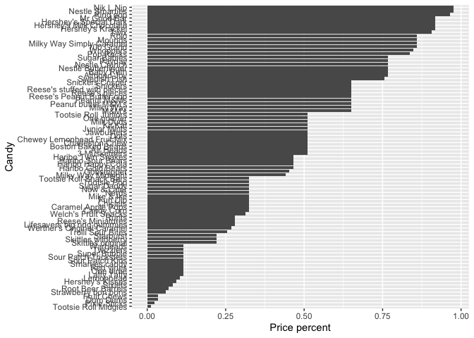
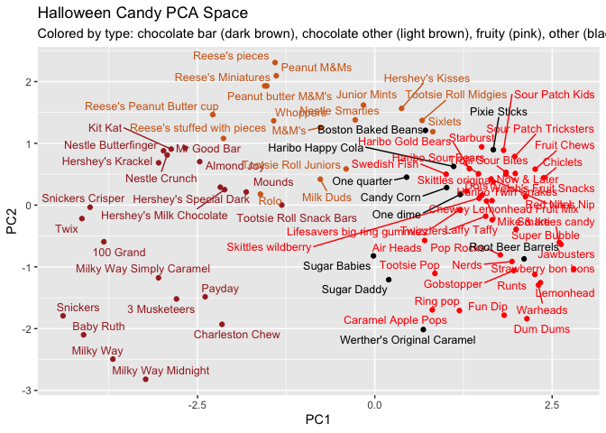

# Class 9 Candy Mini-Project
Katherine Quach (A18541014)

- [Background](#background)
- [Data Input](#data-input)
- [Exploratory Analysis](#exploratory-analysis)
- [Exploring the Correlation
  Structure](#exploring-the-correlation-structure)
- [Principal Component Analysis
  (PCA)](#principal-component-analysis-pca)

## Background

In this mini-project, you will explore FiveThirtyEight’s Halloween Candy
dataset.

We will use lots of **ggplot** some basic stats, correlation analysis
and PCA to make sense of the landscape of US candy - something hopefully
more relateable than the proteomics and transcriptomics work that we
will use these methods on throughout the rest of the course.

## Data Input

Our data is a CSV file so we use `read.csv()`

``` r
candy <- read.csv("candy-data.csv", row.names = 1)
head(candy)
```

                 chocolate fruity caramel peanutyalmondy nougat crispedricewafer
    100 Grand            1      0       1              0      0                1
    3 Musketeers         1      0       0              0      1                0
    One dime             0      0       0              0      0                0
    One quarter          0      0       0              0      0                0
    Air Heads            0      1       0              0      0                0
    Almond Joy           1      0       0              1      0                0
                 hard bar pluribus sugarpercent pricepercent winpercent
    100 Grand       0   1        0        0.732        0.860   66.97173
    3 Musketeers    0   1        0        0.604        0.511   67.60294
    One dime        0   0        0        0.011        0.116   32.26109
    One quarter     0   0        0        0.011        0.511   46.11650
    Air Heads       0   0        0        0.906        0.511   52.34146
    Almond Joy      0   1        0        0.465        0.767   50.34755

> Q1. How many different candy types are in this dataset?

``` r
candy$fruity
```

     [1] 0 0 0 0 1 0 0 0 0 1 0 1 1 1 1 1 1 1 1 0 1 1 0 0 0 0 1 0 0 1 1 1 0 0 1 0 0 0
    [39] 0 0 0 1 0 0 1 1 0 0 0 1 1 0 0 0 0 1 0 0 1 0 1 1 0 1 0 0 1 1 1 1 0 0 1 1 1 0
    [77] 0 0 1 0 1 1 1 0 0

``` r
nrow(candy)
```

    [1] 85

> Q2. How many fruity candy types are in the dataset?

``` r
sum(candy$fruity)
```

    [1] 38

> Q3. What is your favorite candy (other than Twix) in the dataset and
> what is it’s winpercent value?

``` r
library(dplyr)
```


    Attaching package: 'dplyr'

    The following objects are masked from 'package:stats':

        filter, lag

    The following objects are masked from 'package:base':

        intersect, setdiff, setequal, union

``` r
candy |> filter(row.names(candy) == "Sour Patch Kids") |>
  select(winpercent)
```

                    winpercent
    Sour Patch Kids     59.864

> Q4. What is the winpercent value for “Kit Kat”?

``` r
candy["Kit Kat", ]$winpercent
```

    [1] 76.7686

**I prefer this format because it’s shorter than loading the library()**

> Q5. What is the winpercent value for “Tootsie Roll Snack Bars”?

``` r
candy["Tootsie Roll Snack Bars", ]$winpercent
```

    [1] 49.6535

> Q6. Is there any variable/column that looks to be on a different scale
> to the majority of the other columns in the dataset?

Yes. The winpercent column has values that are beyond the 0-1 scale that
the other columns have.

``` r
library("skimr")
skim(candy)
```

|                                                  |       |
|:-------------------------------------------------|:------|
| Name                                             | candy |
| Number of rows                                   | 85    |
| Number of columns                                | 12    |
| \_\_\_\_\_\_\_\_\_\_\_\_\_\_\_\_\_\_\_\_\_\_\_   |       |
| Column type frequency:                           |       |
| numeric                                          | 12    |
| \_\_\_\_\_\_\_\_\_\_\_\_\_\_\_\_\_\_\_\_\_\_\_\_ |       |
| Group variables                                  | None  |

Data summary

**Variable type: numeric**

| skim_variable | n_missing | complete_rate | mean | sd | p0 | p25 | p50 | p75 | p100 | hist |
|:---|---:|---:|---:|---:|---:|---:|---:|---:|---:|:---|
| chocolate | 0 | 1 | 0.44 | 0.50 | 0.00 | 0.00 | 0.00 | 1.00 | 1.00 | ▇▁▁▁▆ |
| fruity | 0 | 1 | 0.45 | 0.50 | 0.00 | 0.00 | 0.00 | 1.00 | 1.00 | ▇▁▁▁▆ |
| caramel | 0 | 1 | 0.16 | 0.37 | 0.00 | 0.00 | 0.00 | 0.00 | 1.00 | ▇▁▁▁▂ |
| peanutyalmondy | 0 | 1 | 0.16 | 0.37 | 0.00 | 0.00 | 0.00 | 0.00 | 1.00 | ▇▁▁▁▂ |
| nougat | 0 | 1 | 0.08 | 0.28 | 0.00 | 0.00 | 0.00 | 0.00 | 1.00 | ▇▁▁▁▁ |
| crispedricewafer | 0 | 1 | 0.08 | 0.28 | 0.00 | 0.00 | 0.00 | 0.00 | 1.00 | ▇▁▁▁▁ |
| hard | 0 | 1 | 0.18 | 0.38 | 0.00 | 0.00 | 0.00 | 0.00 | 1.00 | ▇▁▁▁▂ |
| bar | 0 | 1 | 0.25 | 0.43 | 0.00 | 0.00 | 0.00 | 0.00 | 1.00 | ▇▁▁▁▂ |
| pluribus | 0 | 1 | 0.52 | 0.50 | 0.00 | 0.00 | 1.00 | 1.00 | 1.00 | ▇▁▁▁▇ |
| sugarpercent | 0 | 1 | 0.48 | 0.28 | 0.01 | 0.22 | 0.47 | 0.73 | 0.99 | ▇▇▇▇▆ |
| pricepercent | 0 | 1 | 0.47 | 0.29 | 0.01 | 0.26 | 0.47 | 0.65 | 0.98 | ▇▇▇▇▆ |
| winpercent | 0 | 1 | 50.32 | 14.71 | 22.45 | 39.14 | 47.83 | 59.86 | 84.18 | ▃▇▆▅▂ |

> Q7. What do you think a zero and one represent for the
> `candy$chocolate` column?

In the `candy$chocolate` column, the 0 represents FALSE, meaning that
the candy is does NOT contain chocolate. The 1 in the column represents
TRUE, hence the candy does contain chocolate.

## Exploratory Analysis

> Q8. Plot a histogram of winpercent values

``` r
hist(candy$winpercent)
```


``` r
library(ggplot2)

ggplot(candy, aes(x = winpercent)) +
  geom_histogram(bins = 20, fill = "#BF3EFF", color = "black") +
  labs(
    x = "Candy Win %",
    y = "Frequency",
    title = "Distribution of Candy Win Percentage")
```



> Q9. Is the distribution of winpercent values symmetrical?

The distribution of winpercent values is not symmetrical

> Q10. Is the center of the distribution above or below 50%?

The center of the distribution is above 50%

``` r
mean(candy$winpercent)
```

    [1] 50.31676

``` r
summary(candy$winpercent)
```

       Min. 1st Qu.  Median    Mean 3rd Qu.    Max. 
      22.45   39.14   47.83   50.32   59.86   84.18 

> Q11. On average is chocolate candy higher or lower ranked than fruit
> candy?

1.  Find all chocolate candy
2.  Get their winpercent values
3.  Find the mean
4.  Find all fruit candy
5.  Get their winpercent values
6.  Find the mean
7.  Compare the two means

On average, chocolate candy is ranked higher than fruit candy

``` r
choc.candy <- candy[candy$chocolate == 1, ]
choc.win <- choc.candy$winpercent
mean(choc.win)
```

    [1] 60.92153

``` r
fruit.candy <- candy[candy$fruity == 1, ]
fruit.win <- fruit.candy$winpercent
mean(fruit.win)
```

    [1] 44.11974

> Q12. Is this difference statistically significant?

This difference is statistically significant

``` r
t.test(choc.win, fruit.win)
```


        Welch Two Sample t-test

    data:  choc.win and fruit.win
    t = 6.2582, df = 68.882, p-value = 2.871e-08
    alternative hypothesis: true difference in means is not equal to 0
    95 percent confidence interval:
     11.44563 22.15795
    sample estimates:
    mean of x mean of y 
     60.92153  44.11974 

> Q13. What are the five least liked candy types in this set?

``` r
tail(candy[order(candy$winpercent),], n=5)
```

                              chocolate fruity caramel peanutyalmondy nougat
    Snickers                          1      0       1              1      1
    Kit Kat                           1      0       0              0      0
    Twix                              1      0       1              0      0
    Reese's Miniatures                1      0       0              1      0
    Reese's Peanut Butter cup         1      0       0              1      0
                              crispedricewafer hard bar pluribus sugarpercent
    Snickers                                 0    0   1        0        0.546
    Kit Kat                                  1    0   1        0        0.313
    Twix                                     1    0   1        0        0.546
    Reese's Miniatures                       0    0   0        0        0.034
    Reese's Peanut Butter cup                0    0   0        0        0.720
                              pricepercent winpercent
    Snickers                         0.651   76.67378
    Kit Kat                          0.511   76.76860
    Twix                             0.906   81.64291
    Reese's Miniatures               0.279   81.86626
    Reese's Peanut Butter cup        0.651   84.18029

> Q14. What are the top 5 all time favorite candy types out of this set?

``` r
head(candy[order(candy$winpercent),], n=5)
```

                       chocolate fruity caramel peanutyalmondy nougat
    Nik L Nip                  0      1       0              0      0
    Boston Baked Beans         0      0       0              1      0
    Chiclets                   0      1       0              0      0
    Super Bubble               0      1       0              0      0
    Jawbusters                 0      1       0              0      0
                       crispedricewafer hard bar pluribus sugarpercent pricepercent
    Nik L Nip                         0    0   0        1        0.197        0.976
    Boston Baked Beans                0    0   0        1        0.313        0.511
    Chiclets                          0    0   0        1        0.046        0.325
    Super Bubble                      0    0   0        0        0.162        0.116
    Jawbusters                        0    1   0        1        0.093        0.511
                       winpercent
    Nik L Nip            22.44534
    Boston Baked Beans   23.41782
    Chiclets             24.52499
    Super Bubble         27.30386
    Jawbusters           28.12744

> Q15. Make a first barplot of candy ranking based on winpercent values.

``` r
ggplot(candy) + 
  aes(winpercent, rownames(candy)) +
  geom_col() +
ylab("")
```



> Q16. This is quite ugly, use the reorder() function to get the bars
> sorted by winpercent?

``` r
ggplot(candy) + 
  aes(winpercent,
      reorder(rownames(candy), winpercent)) +
  geom_col() +
ylab("")
```


``` r
ggplot(candy) + 
  aes(winpercent,
      reorder(rownames(candy), winpercent),
      fill = chocolate) +
  geom_col() +
ylab("")
```



We need a custom color vector

``` r
my_cols <- rep("black", nrow(candy))
my_cols[candy$chocolate == 1] <-  "chocolate"
my_cols[candy$bar == 1] <-  "brown"
my_cols[candy$fruity == 1] <-  "pink"
my_cols
```

     [1] "brown"     "brown"     "black"     "black"     "pink"      "brown"    
     [7] "brown"     "black"     "black"     "pink"      "brown"     "pink"     
    [13] "pink"      "pink"      "pink"      "pink"      "pink"      "pink"     
    [19] "pink"      "black"     "pink"      "pink"      "chocolate" "brown"    
    [25] "brown"     "brown"     "pink"      "chocolate" "brown"     "pink"     
    [31] "pink"      "pink"      "chocolate" "chocolate" "pink"      "chocolate"
    [37] "brown"     "brown"     "brown"     "brown"     "brown"     "pink"     
    [43] "brown"     "brown"     "pink"      "pink"      "brown"     "chocolate"
    [49] "black"     "pink"      "pink"      "chocolate" "chocolate" "chocolate"
    [55] "chocolate" "pink"      "chocolate" "black"     "pink"      "chocolate"
    [61] "pink"      "pink"      "chocolate" "pink"      "brown"     "brown"    
    [67] "pink"      "pink"      "pink"      "pink"      "black"     "black"    
    [73] "pink"      "pink"      "pink"      "chocolate" "chocolate" "brown"    
    [79] "pink"      "brown"     "pink"      "pink"      "pink"      "black"    
    [85] "chocolate"

``` r
ggplot(candy) + 
  aes(winpercent,
      reorder(rownames(candy), winpercent)) +
  geom_col(fill = my_cols) +
ylab("")
```


> Q17. What is the worst ranked chocolate candy?

The worst ranked chocolate candy is Sixlets

``` r
rownames(candy)[candy$chocolate == 1][which.min(candy$winpercent[candy$chocolate == 1])]
```

    [1] "Sixlets"

> Q18. What is the best ranked fruity candy?

The best ranked fruity candy is Starburst

``` r
rownames(candy)[candy$fruity == 1][which.max(candy$winpercent[candy$fruity == 1])]
```

    [1] "Starburst"

``` r
library(ggrepel)

my_cols[candy$fruity == 1] <- "red"

# How about a plot of win vs price
ggplot(candy) +
  aes(winpercent, pricepercent, label=rownames(candy)) +
  geom_point(col=my_cols) + 
  geom_text_repel(col=my_cols, size=3.3, max.overlaps = 17)
```



> Q19. Which candy type is the highest ranked in terms of winpercent for
> the least money - i.e. offers the most bang for your buck?

The candy that’s highest ranked in terms of winpercent for the least
money is chocolate candy

``` r
min_price <- min(candy$pricepercent)

cheap_candies <- candy[candy$pricepercent == min_price, ]

best_row <- which.max(cheap_candies$winpercent)

colnames(cheap_candies)[best_row]
```

    [1] "chocolate"

> Q20. What are the top 5 most expensive candy types in the dataset and
> of these which is the least popular?

The top 5 most expensive candy types in the dataset are as follows:

``` r
ord <- order(candy$pricepercent, decreasing = TRUE)
head(candy[ord,c(11,12)], n=5)
```

                             pricepercent winpercent
    Nik L Nip                       0.976   22.44534
    Nestle Smarties                 0.976   37.88719
    Ring pop                        0.965   35.29076
    Hershey's Krackel               0.918   62.28448
    Hershey's Milk Chocolate        0.918   56.49050

> Q21. Make a barplot again with geom_col() this time using pricepercent
> and then improve this step by step, first ordering the x-axis by value
> and finally making a so called “dot chat” or “lollipop” chart by
> swapping geom_col() for geom_point() + geom_segment().

``` r
ggplot(candy,
       aes(x = reorder(rownames(candy), pricepercent),
           y = pricepercent)) +
  geom_col() +
  coord_flip() +
  labs(x = "Candy", y = "Price percent")
```



``` r
ggplot(candy) +
  aes(pricepercent, reorder(rownames(candy), pricepercent)) +
  geom_segment(aes(yend = reorder(rownames(candy), pricepercent), 
                   xend = 0), col="gray40") +
    geom_point()
```


## Exploring the Correlation Structure

``` r
cij <- cor(candy)
```

``` r
library(corrplot)
```

    corrplot 0.95 loaded

``` r
corrplot(cij)
```


> Q22. Examining this plot what two variables are anti-correlated
> (i.e. have minus values)?

The 2 variables that are anti-correlated are chocolate and fruity.

> Q23. Similarly, what two variables are most positively correlated?

The 2 variables that are most positively correlated are chocolate and
bar.

## Principal Component Analysis (PCA)

``` r
candy2 <- read.csv("candy-data.csv", row.name = 1)

pca <- prcomp(candy2, scale = TRUE)
summary(pca)
```

    Importance of components:
                              PC1    PC2    PC3     PC4    PC5     PC6     PC7
    Standard deviation     2.0788 1.1378 1.1092 1.07533 0.9518 0.81923 0.81530
    Proportion of Variance 0.3601 0.1079 0.1025 0.09636 0.0755 0.05593 0.05539
    Cumulative Proportion  0.3601 0.4680 0.5705 0.66688 0.7424 0.79830 0.85369
                               PC8     PC9    PC10    PC11    PC12
    Standard deviation     0.74530 0.67824 0.62349 0.43974 0.39760
    Proportion of Variance 0.04629 0.03833 0.03239 0.01611 0.01317
    Cumulative Proportion  0.89998 0.93832 0.97071 0.98683 1.00000

Score Plot…

``` r
ggplot(pca$x) +
  aes(PC1, PC2, label = row.names(pca$x)) +
  geom_point(col = my_cols) +
geom_text_repel(max.overlaps = 30, size = 3.3, col = my_cols) +
  theme(legend.position = "none") +
  labs(title="Halloween Candy PCA Space",
       subtitle="Colored by type: chocolate bar (dark brown), chocolate other (light brown), fruity (pink), other (black)")
```



``` r
ggplot(pca$rotation) +
  aes(PC1,
    y = reorder(row.names(pca$rotation), PC1), x = PC1) +
  geom_col()
```


> Q24. Complete the code to generate the loadings plot above. What
> original variables are picked up strongly by PC1 in the positive
> direction? Do these make sense to you? Where did you see this
> relationship highlighted previously?

The variables that are picked up strongly by PC1 in the positive
direction are “fruity”, “pluribus”, and “hard”. Yes, this does make
sense. PC1 separates the fruity, hard, sugary, and non-chocolate candies
from the chocolate candies. The positive loadings are hard, fruit
candies, whereas the negative loadings describe chocolate bars
(e.g. chocolate, bar, caramel, nougat, etc.). This relationship was
previously highlighted in the correlation structure where chocolate and
fruity were the most anti-correlated pair. Hard candies also tended to
be non-chocolate, which was denoted by PC1. This was also evident in the
PCA scatter plot where fruity candies were clustered on one side of PC1
and chocolate was clustered on the opposite side. PC1 visually separates
the candy types in the same way the loading plots above explain
numerically.

> Q25. Based on your exploratory analysis, correlation findings, and PCA
> results, what combination of characteristics appears to make a
> “winning” candy? How do these different analyses (visualization,
> correlation, PCA) support or complement each other in reaching this
> conclusion?

To make a “winning” candy, it must be chocolate-based, include caramel,
nougat, or nuts, and come bar-shaped. They are not fruity, hard, or
pluribus, and skew slightly higher in pricepercent. Exploratory plots
showed that these candies (e.g. chocolate bars) were more likely to be
clustered at the top of winpercent, whereas fruity/hard candies were
clustered farther away. The correlation matrix revealed strong positive
correlations between chocolate, bar, caramel, and peanutyalmondy traits,
and a strong negative correlation with fruity and hard candies. PCA
loadings grouped chocolate, bar, caramel, nougat, and nuts on the
opposite side of fruity/hard candies. This indicates that through
visualization, correlation, and PCA analyses, chocolate bar with
caramel/nougat/nuts with a slightly premium price makes a “winning”
candy.
