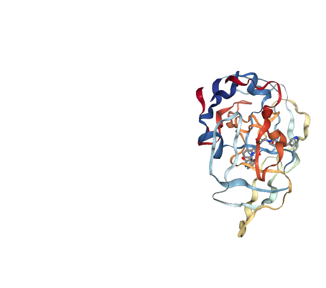
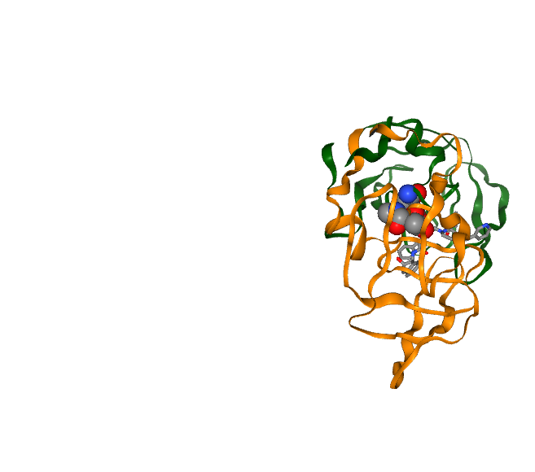
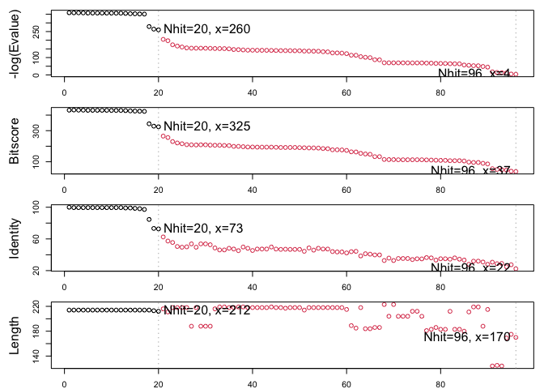
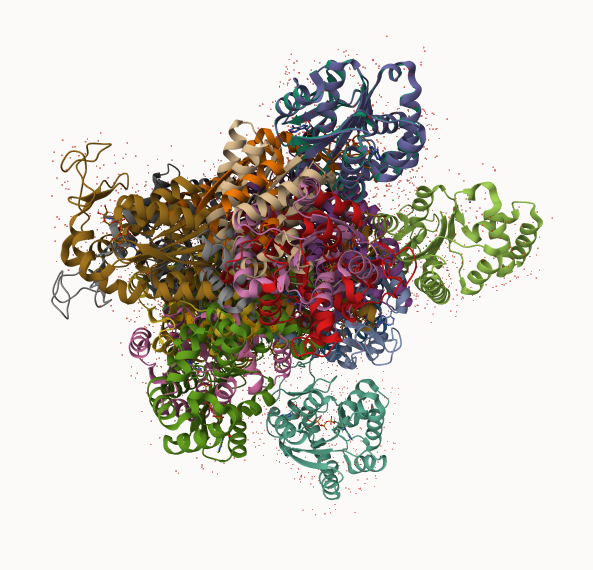
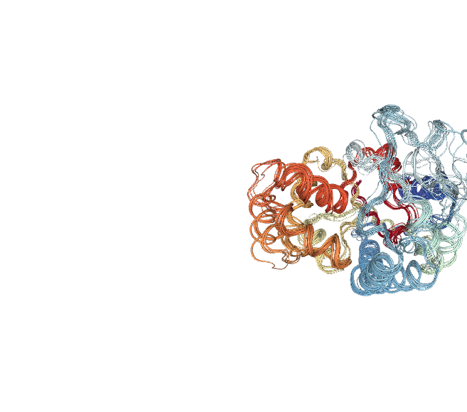
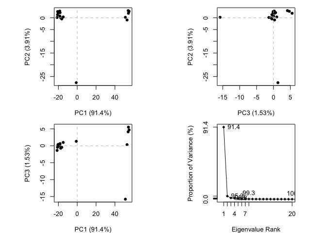

# Class 10: Structural Bioinformatics 1
Katherine Quach (A18541014)

- [PDB Statistics](#pdb-statistics)
- [Visualizing the HIV-1 protease
  structure](#visualizing-the-hiv-1-protease-structure)
- [Bio3D package for structural
  bioinformatics](#bio3d-package-for-structural-bioinformatics)
- [Predicting functional motions of a single
  structure](#predicting-functional-motions-of-a-single-structure)
- [Comparative Analysis with PCA](#comparative-analysis-with-pca)
- [PCA](#pca)

## PDB Statistics

The Protein Data Bank (PDB) is the main repository of bio-molecular
structures. Let’s see what it contains:

``` r
stats <- read.csv("Data Export Summary.csv")
stats
```

               Molecular.Type   X.ray     EM    NMR Integrative Multiple.methods
    1          Protein (only) 178,795 21,825 12,773         343              226
    2 Protein/Oligosaccharide  10,363  3,564     34           8               11
    3              Protein/NA   9,106  6,335    287          24                7
    4     Nucleic acid (only)   3,132    221  1,566           3               15
    5                   Other     175     25     33           4                0
    6  Oligosaccharide (only)      11      0      6           0                1
      Neutron Other   Total
    1      84    32 214,078
    2       1     0  13,981
    3       0     0  15,759
    4       3     1   4,941
    5       0     0     237
    6       0     4      22

``` r
sum(stats$Neutron)
```

    [1] 88

The commna in these numbers leads to the numbers here being read as
characters

``` r
c(100, "Barry")
```

    [1] "100"   "Barry"

``` r
library(readr)
stats <- read_csv("Data Export Summary.csv")
```

    Rows: 6 Columns: 9
    ── Column specification ────────────────────────────────────────────────────────
    Delimiter: ","
    chr (1): Molecular Type
    dbl (4): Integrative, Multiple methods, Neutron, Other
    num (4): X-ray, EM, NMR, Total

    ℹ Use `spec()` to retrieve the full column specification for this data.
    ℹ Specify the column types or set `show_col_types = FALSE` to quiet this message.

``` r
stats
```

    # A tibble: 6 × 9
      `Molecular Type`    `X-ray`    EM   NMR Integrative `Multiple methods` Neutron
      <chr>                 <dbl> <dbl> <dbl>       <dbl>              <dbl>   <dbl>
    1 Protein (only)       178795 21825 12773         343                226      84
    2 Protein/Oligosacch…   10363  3564    34           8                 11       1
    3 Protein/NA             9106  6335   287          24                  7       0
    4 Nucleic acid (only)    3132   221  1566           3                 15       3
    5 Other                   175    25    33           4                  0       0
    6 Oligosaccharide (o…      11     0     6           0                  1       0
    # ℹ 2 more variables: Other <dbl>, Total <dbl>

``` r
n.xray <- sum(stats$`X-ray`)
#n.em <- 
n.total <- sum(stats$Total)

n.xray/n.total
```

    [1] 0.8095077

> Q1. What percentage of structures in the PDB are solved by X-Ray and
> Electron Microscopy.

``` r
n.xray <- sum(stats$`X-ray`)
n.em <- sum(stats$EM)
n.total <- sum(stats$Total)

(n.xray/n.total) * 100
```

    [1] 80.95077

``` r
(n.em/n.total) * 100
```

    [1] 12.83843

> Q2. What proportion of structures in the PDB are protein?

``` r
n.protein <- sum(stats$Total[grep("Protein", stats$`Molecular Type`)])
(n.protein / n.total) * 100
```

    [1] 97.9118

> Q3. Type HIV in the PDB website search box on the home page and
> determine how many HIV-1 protease structures are in the current PDB?

Skip…

## Visualizing the HIV-1 protease structure

We can use Molstar viewer online: https://molstar.org/viewer/

 A clean image showing the catalytic ASP25
amino acids in both chains of the HIV-PR dimer, along with the inhibitor
and all important active site water.


## Bio3D package for structural bioinformatics

``` r
library(bio3d)

pdb <- read.pdb("1hsg")
```

      Note: Accessing on-line PDB file

``` r
pdb
```


     Call:  read.pdb(file = "1hsg")

       Total Models#: 1
         Total Atoms#: 1686,  XYZs#: 5058  Chains#: 2  (values: A B)

         Protein Atoms#: 1514  (residues/Calpha atoms#: 198)
         Nucleic acid Atoms#: 0  (residues/phosphate atoms#: 0)

         Non-protein/nucleic Atoms#: 172  (residues: 128)
         Non-protein/nucleic resid values: [ HOH (127), MK1 (1) ]

       Protein sequence:
          PQITLWQRPLVTIKIGGQLKEALLDTGADDTVLEEMSLPGRWKPKMIGGIGGFIKVRQYD
          QILIEICGHKAIGTVLVGPTPVNIIGRNLLTQIGCTLNFPQITLWQRPLVTIKIGGQLKE
          ALLDTGADDTVLEEMSLPGRWKPKMIGGIGGFIKVRQYDQILIEICGHKAIGTVLVGPTP
          VNIIGRNLLTQIGCTLNF

    + attr: atom, xyz, seqres, helix, sheet,
            calpha, remark, call

``` r
attributes(pdb)
```

    $names
    [1] "atom"   "xyz"    "seqres" "helix"  "sheet"  "calpha" "remark" "call"  

    $class
    [1] "pdb" "sse"

``` r
head(pdb$atom)
```

      type eleno elety  alt resid chain resno insert      x      y     z o     b
    1 ATOM     1     N <NA>   PRO     A     1   <NA> 29.361 39.686 5.862 1 38.10
    2 ATOM     2    CA <NA>   PRO     A     1   <NA> 30.307 38.663 5.319 1 40.62
    3 ATOM     3     C <NA>   PRO     A     1   <NA> 29.760 38.071 4.022 1 42.64
    4 ATOM     4     O <NA>   PRO     A     1   <NA> 28.600 38.302 3.676 1 43.40
    5 ATOM     5    CB <NA>   PRO     A     1   <NA> 30.508 37.541 6.342 1 37.87
    6 ATOM     6    CG <NA>   PRO     A     1   <NA> 29.296 37.591 7.162 1 38.40
      segid elesy charge
    1  <NA>     N   <NA>
    2  <NA>     C   <NA>
    3  <NA>     C   <NA>
    4  <NA>     O   <NA>
    5  <NA>     C   <NA>
    6  <NA>     C   <NA>

``` r
library(bio3dview)
library(knitr)
library(webshot2)

view.pdb(pdb)
```



``` r
library(knitr)
library(webshot2)

# Select the important ASP 25 residue
sele <- atom.select(pdb, resno=25)

# Highlight them in spacefill representation
view.pdb(pdb, cols=c("darkgreen","darkorange"), 
       highlight = sele,
        highlight.style = "spacefill")
```



## Predicting functional motions of a single structure

Read an ADK structure from the PDB database:

``` r
adk <- read.pdb("6s36")
```

      Note: Accessing on-line PDB file
       PDB has ALT records, taking A only, rm.alt=TRUE

``` r
adk
```


     Call:  read.pdb(file = "6s36")

       Total Models#: 1
         Total Atoms#: 1898,  XYZs#: 5694  Chains#: 1  (values: A)

         Protein Atoms#: 1654  (residues/Calpha atoms#: 214)
         Nucleic acid Atoms#: 0  (residues/phosphate atoms#: 0)

         Non-protein/nucleic Atoms#: 244  (residues: 244)
         Non-protein/nucleic resid values: [ CL (3), HOH (238), MG (2), NA (1) ]

       Protein sequence:
          MRIILLGAPGAGKGTQAQFIMEKYGIPQISTGDMLRAAVKSGSELGKQAKDIMDAGKLVT
          DELVIALVKERIAQEDCRNGFLLDGFPRTIPQADAMKEAGINVDYVLEFDVPDELIVDKI
          VGRRVHAPSGRVYHVKFNPPKVEGKDDVTGEELTTRKDDQEETVRKRLVEYHQMTAPLIG
          YYSKEAEAGNTKYAKVDGTKPVAEVRADLEKILG

    + attr: atom, xyz, seqres, helix, sheet,
            calpha, remark, call

``` r
m <- nma(adk)
```

     Building Hessian...        Done in 0.069 seconds.
     Diagonalizing Hessian...   Done in 1.19 seconds.

``` r
plot(m)
```


Write out our results as a trajectory/movie of predicted motions:

``` r
mktrj(m, file="adk_m7.pdb")
```

## Comparative Analysis with PCA

First step: Find an ADK sequence:

``` r
library(bio3d)
id <- "1ake_A" ## Change this to run a different analysis
aa <- get.seq("1ake_A")
```

    Warning in get.seq("1ake_A"): Removing existing file: seqs.fasta

    Fetching... Please wait. Done.

Next step is to search the PDB database for all related entries:

``` r
blast <- blast.pdb(aa)
```

     Searching ... please wait (updates every 5 seconds) RID = V9U47R8K014 
     ....................................................
     Reporting 96 hits

``` r
hits <- plot(blast)
```

      * Possible cutoff values:    260 3 
                Yielding Nhits:    20 96 

      * Chosen cutoff value of:    260 
                Yielding Nhits:    20 



All the BLAST results are here for us to see:

``` r
blast$hit.tbl
```

             queryid subjectids identity alignmentlength mismatches gapopens
    1  Query_1953179     1AKE_A  100.000             214          0        0
    2  Query_1953179     8BQF_A   99.533             214          1        0
    3  Query_1953179     4X8M_A   99.533             214          1        0
    4  Query_1953179     6S36_A   99.533             214          1        0
    5  Query_1953179     9R6U_A   99.533             214          1        0
    6  Query_1953179     9R71_A   99.533             214          1        0
    7  Query_1953179     8Q2B_A   99.533             214          1        0
    8  Query_1953179     8RJ9_A   99.533             214          1        0
    9  Query_1953179     6RZE_A   99.533             214          1        0
    10 Query_1953179     4X8H_A   99.533             214          1        0
    11 Query_1953179     3HPR_A   99.533             214          1        0
    12 Query_1953179     1E4V_A   99.533             214          1        0
    13 Query_1953179     5EJE_A   99.065             214          2        0
    14 Query_1953179     1E4Y_A   99.065             214          2        0
    15 Query_1953179     3X2S_A   98.598             214          3        0
    16 Query_1953179     6HAP_A   98.131             214          4        0
    17 Query_1953179     6HAM_A   97.196             214          6        0
    18 Query_1953179     8PVW_A   84.579             214          6        2
    19 Query_1953179     4K46_A   73.239             213         57        0
    20 Query_1953179     4NP6_A   72.642             212         58        0
    21 Query_1953179     3GMT_A   62.500             216         75        1
    22 Query_1953179     4PZL_A   57.346             211         86        2
    23 Query_1953179     5G3Y_A   55.505             218         88        2
    24 Query_1953179     5G3Z_A   50.459             218         99        2
    25 Query_1953179     5G40_A   49.541             218        101        2
    26 Query_1953179     5X6J_A   50.000             218         98        3
    27 Query_1953179     2C9Y_A   53.723             188         83        1
    28 Query_1953179     1S3G_A   49.541             218         99        3
    29 Query_1953179     9GR0_A   53.723             188         83        1
    30 Query_1953179     9FL7_D   53.723             188         83        1
    31 Query_1953179     1AK2_A   52.660             188         85        1
    32 Query_1953179     3BE4_A   48.611             216        102        3
    33 Query_1953179     1AKY_A   46.119             219        108        3
    34 Query_1953179     3AKY_A   46.119             219        108        3
    35 Query_1953179     3FB4_A   48.165             218        104        2
    36 Query_1953179     4QBI_A   47.248             218        106        2
    37 Query_1953179     1DVR_A   45.205             219        110        3
    38 Query_1953179     3DKV_A   49.772             219         99        3
    39 Query_1953179     3DL0_A   48.165             218        104        2
    40 Query_1953179     1ZIN_A   45.413             218        110        2
    41 Query_1953179     2P3S_A   47.248             218        106        2
    42 Query_1953179     2EU8_A   47.248             218        106        2
    43 Query_1953179     1P3J_A   47.248             218        106        2
    44 Query_1953179     4QBF_A   49.772             219         99        3
    45 Query_1953179     2ORI_A   47.248             218        106        2
    46 Query_1953179     5X6I_A   46.789             218        107        2
    47 Query_1953179     2QAJ_A   47.005             217        106        2
    48 Query_1953179     2OO7_A   46.789             218        107        2
    49 Query_1953179     2OSB_A   46.789             218        107        2
    50 Query_1953179     4MKF_A   46.789             218        107        2
    51 Query_1953179     3TLX_A   44.393             214        106        3
    52 Query_1953179     4MKH_A   48.624             218        101        3
    53 Query_1953179     4QBH_A   45.872             218        109        2
    54 Query_1953179     4TYQ_A   48.165             218        102        3
    55 Query_1953179     4QBG_B   47.248             218        104        3
    56 Query_1953179     4TYP_A   47.248             218        104        3
    57 Query_1953179     4JKY_A   44.037             218        103        5
    58 Query_1953179     2RGX_A   43.578             218        104        4
    59 Query_1953179     4JLO_A   43.578             218        104        5
    60 Query_1953179     1ZAK_A   42.326             215        112        3
    61 Query_1953179     1ZD8_A   43.915             189         96        3
    62 Query_1953179     2AK3_A   44.324             185        101        2
    63 Query_1953179     4NTZ_A   38.532             218        119        4
    64 Query_1953179     2AR7_A   41.304             184        102        3
    65 Query_1953179     3NDP_A   40.761             184        103        3
    66 Query_1953179     1P4S_A   39.785             186         77        2
    67 Query_1953179     2CDN_A   39.785             186         77        2
    68 Query_1953179     3L0P_A   32.735             223        131        7
    69 Query_1953179     5X6L_A   35.784             204         98        3
    70 Query_1953179     2XB4_A   32.735             223        131        7
    71 Query_1953179     5XRU_A   35.294             204         99        3
    72 Query_1953179     5YCC_A   35.294             204         99        3
    73 Query_1953179     5X6K_A   35.294             204         99        3
    74 Query_1953179     5XZ2_A   33.962             212        107        3
    75 Query_1953179     5YCF_A   34.906             212        105        3
    76 Query_1953179     5YCB_A   34.804             204        100        3
    77 Query_1953179     5YCD_A   36.464             181         87        2
    78 Query_1953179     3ADK_A   36.066             183         89        3
    79 Query_1953179     3UMF_A   33.333             186         92        3
    80 Query_1953179     1Z83_A   34.973             183         91        3
    81 Query_1953179     7X7S_A   34.973             183         91        3
    82 Query_1953179     3CM0_A   34.434             212        106        5
    83 Query_1953179     7DE3_A   36.066             183         89        5
    84 Query_1953179     8X1G_A   34.426             183         92        3
    85 Query_1953179    7N6G_6M   33.333             180        108        4
    86 Query_1953179     1UKY_A   27.962             211        117        5
    87 Query_1953179     1TEV_A   31.963             219        109        7
    88 Query_1953179     7E9V_A   31.963             219        109        7
    89 Query_1953179     2BWJ_A   30.851             188         98        4
    90 Query_1953179     1QF9_A   27.907             215        117        5
    91 Query_1953179    9FQR_Xf   30.645             124         83        2
    93 Query_1953179    9FQR_Xc   28.800             125         56        4
    94 Query_1953179     9D2F_D   29.032             124         56        4
    95 Query_1953179    7N6G_6A   24.852             169         84        6
    96 Query_1953179     9D2F_A   27.429             175         78        6
    92 Query_1953179    9FQR_Xf   22.353             170         83        2
       q.start q.end s.start s.end    evalue bitscore positives mlog.evalue pdb.id
    1        1   214       1   214 1.79e-156    432.0    100.00  358.621059 1AKE_A
    2        1   214      21   234 2.93e-156    433.0    100.00  358.128272 8BQF_A
    3        1   214       1   214 3.21e-156    432.0    100.00  358.037004 4X8M_A
    4        1   214       1   214 4.71e-156    432.0    100.00  357.653587 6S36_A
    5        1   214       1   214 1.05e-155    431.0     99.53  356.851899 9R6U_A
    6        1   214       1   214 1.24e-155    431.0     99.53  356.685578 9R71_A
    7        1   214       1   214 1.25e-155    431.0     99.53  356.677546 8Q2B_A
    8        1   214       1   214 1.25e-155    431.0     99.53  356.677546 8RJ9_A
    9        1   214       1   214 1.35e-155    431.0     99.53  356.600585 6RZE_A
    10       1   214       1   214 1.78e-155    430.0     99.53  356.324076 4X8H_A
    11       1   214       1   214 2.52e-155    430.0     99.53  355.976431 3HPR_A
    12       1   214       1   214 2.67e-155    430.0     99.53  355.918611 1E4V_A
    13       1   214       1   214 7.99e-155    429.0     99.07  354.822499 5EJE_A
    14       1   214       1   214 4.62e-154    427.0     99.07  353.067710 1E4Y_A
    15       1   214       1   214 7.74e-154    426.0     98.60  352.551703 3X2S_A
    16       1   214       1   214 2.29e-153    425.0     98.60  351.466967 6HAP_A
    17       1   214       1   214 4.68e-153    424.0     98.60  350.752221 6HAM_A
    18       1   214       1   187 8.54e-122    344.0     85.05  278.770620 8PVW_A
    19       1   213       1   213 2.08e-115    329.0     84.98  264.064918 4K46_A
    20       2   213       5   216 1.15e-113    325.0     84.43  260.052354 4NP6_A
    21       2   211      10   225  9.02e-90    265.0     71.30  205.033214 3GMT_A
    22       2   209      26   235  2.15e-86    256.0     74.41  197.256850 4PZL_A
    23       1   214       1   213  3.19e-76    230.0     68.81  173.836446 5G3Y_A
    24       1   214       1   213  6.10e-73    221.0     69.27  166.280423 5G3Z_A
    25       1   214       1   213  1.25e-70    216.0     68.35  160.957813 5G40_A
    26       1   213       1   212  2.28e-68    210.0     65.60  155.751611 5X6J_A
    27       1   184      17   204  1.15e-67    209.0     69.68  154.133439 2C9Y_A
    28       1   213       1   212  1.18e-67    208.0     65.14  154.107687 1S3G_A
    29       1   184      16   203  1.25e-67    209.0     69.68  154.050058 9GR0_A
    30       1   184      22   209  1.68e-67    209.0     69.68  153.754407 9FL7_D
    31       1   184      17   204  2.97e-67    207.0     70.21  153.184639 1AK2_A
    32       2   213       7   217  7.98e-67    206.0     68.06  152.196263 3BE4_A
    33       1   214       5   218  1.13e-66    206.0     65.75  151.848399 1AKY_A
    34       1   214       5   218  1.37e-66    205.0     65.30  151.655805 3AKY_A
    35       1   214       1   213  5.04e-66    204.0     65.14  150.353210 3FB4_A
    36       1   214       1   213  2.44e-64    199.0     65.60  146.473448 4QBI_A
    37       1   214       5   218  5.27e-64    199.0     64.84  145.703416 1DVR_A
    38       1   214       1   213  2.83e-63    197.0     66.67  144.022584 3DKV_A
    39       1   214       1   213  1.25e-62    195.0     66.97  142.537132 3DL0_A
    40       1   214       1   213  1.39e-62    195.0     65.60  142.430972 1ZIN_A
    41       1   214       1   213  2.10e-62    194.0     66.97  142.018338 2P3S_A
    42       1   214       1   213  2.20e-62    194.0     66.97  141.971818 2EU8_A
    43       1   214       1   213  2.98e-62    194.0     66.97  141.668352 1P3J_A
    44       1   214       1   213  4.76e-62    194.0     66.21  141.200028 4QBF_A
    45       1   214       1   213  7.45e-62    193.0     66.97  140.752062 2ORI_A
    46       1   214       1   213  1.41e-61    192.0     66.51  140.114101 5X6I_A
    47       1   213       1   212  1.53e-61    192.0     66.82  140.032423 2QAJ_A
    48       1   214       1   213  1.78e-61    192.0     66.51  139.881077 2OO7_A
    49       1   214       1   213  3.03e-61    192.0     66.51  139.349128 2OSB_A
    50       1   214       1   213  3.38e-61    191.0     66.51  139.239815 4MKF_A
    51       2   211      31   235  2.13e-60    190.0     64.95  137.398984 3TLX_A
    52       1   213       3   214  2.18e-60    189.0     65.60  137.375781 4MKH_A
    53       1   214       1   213  4.36e-60    189.0     64.68  136.682634 4QBH_A
    54       1   213       1   212  5.37e-60    188.0     65.60  136.474278 4TYQ_A
    55       1   213       1   212  9.39e-59    185.0     65.60  133.612875 4QBG_B
    56       1   213       1   212  1.77e-58    184.0     65.14  132.978956 4TYP_A
    57       1   214       1   203  8.11e-56    177.0     66.51  126.851667 4JKY_A
    58       1   214       1   203  9.29e-56    177.0     65.60  126.715827 2RGX_A
    59       1   214       1   203  2.77e-55    176.0     66.51  125.623333 4JLO_A
    60       1   214       6   209  5.58e-54    173.0     63.72  122.620406 1ZAK_A
    61       1   185       8   190  4.34e-50    164.0     64.55  113.661380 1ZD8_A
    62       1   185       7   189  5.97e-50    163.0     65.41  113.342508 2AK3_A
    63       1   213       6   213  2.13e-46    154.0     62.39  105.162792 4NTZ_A
    64       1   182      28   207  7.51e-45    150.0     64.13  101.600094 2AR7_A
    65       1   182       6   185  6.28e-44    148.0     63.59   99.476374 3NDP_A
    66       1   182       1   155  1.04e-38    133.0     56.99   87.459013 1P4S_A
    67       1   182      21   175  1.88e-38    133.0     56.99   86.866962 2CDN_A
    68       1   209       1   218  4.01e-31    115.0     54.26   69.991347 3L0P_A
    69       3   205      13   184  4.89e-31    114.0     52.45   69.792946 5X6L_A
    70       1   209       1   218  5.29e-31    114.0     54.26   69.714320 2XB4_A
    71       3   205      11   182  5.88e-31    113.0     52.45   69.608581 5XRU_A
    72       3   205      11   182  6.91e-31    113.0     52.45   69.447168 5YCC_A
    73       3   205      13   184  8.19e-31    113.0     52.45   69.277224 5X6K_A
    74       3   213      13   192  9.66e-31    113.0     52.83   69.112144 5XZ2_A
    75       3   213      11   190  9.84e-31    113.0     51.89   69.093682 5YCF_A
    76       3   205      11   182  1.06e-30    113.0     52.45   69.019284 5YCB_A
    77       3   182      11   164  2.81e-30    112.0     54.70   68.044368 5YCD_A
    78       3   184      12   167  3.37e-30    111.0     54.10   67.862640 3ADK_A
    79       3   185      32   188  1.78e-29    110.0     56.45   66.198354 3UMF_A
    80       3   184      12   167  2.09e-29    109.0     54.64   66.037804 1Z83_A
    81       3   184      16   171  2.48e-29    109.0     54.64   65.866709 7X7S_A
    82       3   214       7   185  1.01e-28    107.0     50.94   64.462432 3CM0_A
    83       3   184      11   166  1.33e-28    107.0     56.28   64.187204 7DE3_A
    84       3   184      11   166  1.67e-28    107.0     54.10   63.959559 8X1G_A
    85       1   168    1239  1418  1.73e-25    105.0     53.33   57.016506 7N6G_6
    86       3   210      18   196  1.09e-24     97.8     53.55   55.175865 1UKY_A
    87       3   213       6   192  7.72e-24     95.5     49.77   53.218228 1TEV_A
    88       3   213      24   210  1.20e-23     95.5     49.77   52.777136 7E9V_A
    89       3   187      15   173  7.97e-22     90.1     49.47   48.581188 2BWJ_A
    90       3   213       9   189  3.10e-20     85.9     47.44   44.920300 1QF9_A
    91       1   121    1411  1534  2.10e-08     55.5     50.00   17.678743 9FQR_x
    93       1    93     368   491  6.75e-07     50.8     46.40   14.208553 9FQR_x
    94       1    93     368   490  3.39e-06     48.9     45.16   12.594681 9D2F_D
    95      76   207     760   922  1.45e-05     47.0     42.01   11.141362 7N6G_6
    96       1   126     976  1150  6.00e-03     39.3     42.29    5.115996 9D2F_A
    92       1   121     991  1160  2.30e-02     37.4     37.65    3.772261 9FQR_x
           acc
    1   1AKE_A
    2   8BQF_A
    3   4X8M_A
    4   6S36_A
    5   9R6U_A
    6   9R71_A
    7   8Q2B_A
    8   8RJ9_A
    9   6RZE_A
    10  4X8H_A
    11  3HPR_A
    12  1E4V_A
    13  5EJE_A
    14  1E4Y_A
    15  3X2S_A
    16  6HAP_A
    17  6HAM_A
    18  8PVW_A
    19  4K46_A
    20  4NP6_A
    21  3GMT_A
    22  4PZL_A
    23  5G3Y_A
    24  5G3Z_A
    25  5G40_A
    26  5X6J_A
    27  2C9Y_A
    28  1S3G_A
    29  9GR0_A
    30  9FL7_D
    31  1AK2_A
    32  3BE4_A
    33  1AKY_A
    34  3AKY_A
    35  3FB4_A
    36  4QBI_A
    37  1DVR_A
    38  3DKV_A
    39  3DL0_A
    40  1ZIN_A
    41  2P3S_A
    42  2EU8_A
    43  1P3J_A
    44  4QBF_A
    45  2ORI_A
    46  5X6I_A
    47  2QAJ_A
    48  2OO7_A
    49  2OSB_A
    50  4MKF_A
    51  3TLX_A
    52  4MKH_A
    53  4QBH_A
    54  4TYQ_A
    55  4QBG_B
    56  4TYP_A
    57  4JKY_A
    58  2RGX_A
    59  4JLO_A
    60  1ZAK_A
    61  1ZD8_A
    62  2AK3_A
    63  4NTZ_A
    64  2AR7_A
    65  3NDP_A
    66  1P4S_A
    67  2CDN_A
    68  3L0P_A
    69  5X6L_A
    70  2XB4_A
    71  5XRU_A
    72  5YCC_A
    73  5X6K_A
    74  5XZ2_A
    75  5YCF_A
    76  5YCB_A
    77  5YCD_A
    78  3ADK_A
    79  3UMF_A
    80  1Z83_A
    81  7X7S_A
    82  3CM0_A
    83  7DE3_A
    84  8X1G_A
    85 7N6G_6M
    86  1UKY_A
    87  1TEV_A
    88  7E9V_A
    89  2BWJ_A
    90  1QF9_A
    91 9FQR_Xf
    93 9FQR_Xc
    94  9D2F_D
    95 7N6G_6A
    96  9D2F_A
    92 9FQR_Xf

The “top hits” are in the `hits` object. Now we can download these to
our computer. Put these in sub-folder (director) called “pdbs” and use
gzip to speed things up.

``` r
# Download related PDB files
files <- get.pdb(hits$pdb.id, path="pdbs", split=TRUE, gzip=TRUE)
```

    Warning in get.pdb(hits$pdb.id, path = "pdbs", split = TRUE, gzip = TRUE):
    pdbs/1AKE.pdb.gz exists. Skipping download

    Warning in get.pdb(hits$pdb.id, path = "pdbs", split = TRUE, gzip = TRUE):
    pdbs/8BQF.pdb.gz exists. Skipping download

    Warning in get.pdb(hits$pdb.id, path = "pdbs", split = TRUE, gzip = TRUE):
    pdbs/4X8M.pdb.gz exists. Skipping download

    Warning in get.pdb(hits$pdb.id, path = "pdbs", split = TRUE, gzip = TRUE):
    pdbs/6S36.pdb.gz exists. Skipping download

    Warning in get.pdb(hits$pdb.id, path = "pdbs", split = TRUE, gzip = TRUE):
    pdbs/9R6U.pdb.gz exists. Skipping download

    Warning in get.pdb(hits$pdb.id, path = "pdbs", split = TRUE, gzip = TRUE):
    pdbs/9R71.pdb.gz exists. Skipping download

    Warning in get.pdb(hits$pdb.id, path = "pdbs", split = TRUE, gzip = TRUE):
    pdbs/8Q2B.pdb.gz exists. Skipping download

    Warning in get.pdb(hits$pdb.id, path = "pdbs", split = TRUE, gzip = TRUE):
    pdbs/8RJ9.pdb.gz exists. Skipping download

    Warning in get.pdb(hits$pdb.id, path = "pdbs", split = TRUE, gzip = TRUE):
    pdbs/6RZE.pdb.gz exists. Skipping download

    Warning in get.pdb(hits$pdb.id, path = "pdbs", split = TRUE, gzip = TRUE):
    pdbs/4X8H.pdb.gz exists. Skipping download

    Warning in get.pdb(hits$pdb.id, path = "pdbs", split = TRUE, gzip = TRUE):
    pdbs/3HPR.pdb.gz exists. Skipping download

    Warning in get.pdb(hits$pdb.id, path = "pdbs", split = TRUE, gzip = TRUE):
    pdbs/1E4V.pdb.gz exists. Skipping download

    Warning in get.pdb(hits$pdb.id, path = "pdbs", split = TRUE, gzip = TRUE):
    pdbs/5EJE.pdb.gz exists. Skipping download

    Warning in get.pdb(hits$pdb.id, path = "pdbs", split = TRUE, gzip = TRUE):
    pdbs/1E4Y.pdb.gz exists. Skipping download

    Warning in get.pdb(hits$pdb.id, path = "pdbs", split = TRUE, gzip = TRUE):
    pdbs/3X2S.pdb.gz exists. Skipping download

    Warning in get.pdb(hits$pdb.id, path = "pdbs", split = TRUE, gzip = TRUE):
    pdbs/6HAP.pdb.gz exists. Skipping download

    Warning in get.pdb(hits$pdb.id, path = "pdbs", split = TRUE, gzip = TRUE):
    pdbs/6HAM.pdb.gz exists. Skipping download

    Warning in get.pdb(hits$pdb.id, path = "pdbs", split = TRUE, gzip = TRUE):
    pdbs/8PVW.pdb.gz exists. Skipping download

    Warning in get.pdb(hits$pdb.id, path = "pdbs", split = TRUE, gzip = TRUE):
    pdbs/4K46.pdb.gz exists. Skipping download

    Warning in get.pdb(hits$pdb.id, path = "pdbs", split = TRUE, gzip = TRUE):
    pdbs/4NP6.pdb.gz exists. Skipping download


      |                                                                            
      |                                                                      |   0%
      |                                                                            
      |====                                                                  |   5%
      |                                                                            
      |=======                                                               |  10%
      |                                                                            
      |==========                                                            |  15%
      |                                                                            
      |==============                                                        |  20%
      |                                                                            
      |==================                                                    |  25%
      |                                                                            
      |=====================                                                 |  30%
      |                                                                            
      |========================                                              |  35%
      |                                                                            
      |============================                                          |  40%
      |                                                                            
      |================================                                      |  45%
      |                                                                            
      |===================================                                   |  50%
      |                                                                            
      |======================================                                |  55%
      |                                                                            
      |==========================================                            |  60%
      |                                                                            
      |==============================================                        |  65%
      |                                                                            
      |=================================================                     |  70%
      |                                                                            
      |====================================================                  |  75%
      |                                                                            
      |========================================================              |  80%
      |                                                                            
      |============================================================          |  85%
      |                                                                            
      |===============================================================       |  90%
      |                                                                            
      |==================================================================    |  95%
      |                                                                            
      |======================================================================| 100%

These look like a hot mess



Next we will use the `pdbaln()` function to align and also optionally
fit (i.e. superpose) the identified PDB structures.

This requires a BioConductor package called “msa” that we need to
install. First we install BiocManager. Then we use
`BiocManager::install("msa")`

``` r
# Align releated PDBs
pdbs <- pdbaln(files, fit = TRUE, exefile="msa")
```

    Reading PDB files:
    pdbs/split_chain/1AKE_A.pdb
    pdbs/split_chain/8BQF_A.pdb
    pdbs/split_chain/4X8M_A.pdb
    pdbs/split_chain/6S36_A.pdb
    pdbs/split_chain/9R6U_A.pdb
    pdbs/split_chain/9R71_A.pdb
    pdbs/split_chain/8Q2B_A.pdb
    pdbs/split_chain/8RJ9_A.pdb
    pdbs/split_chain/6RZE_A.pdb
    pdbs/split_chain/4X8H_A.pdb
    pdbs/split_chain/3HPR_A.pdb
    pdbs/split_chain/1E4V_A.pdb
    pdbs/split_chain/5EJE_A.pdb
    pdbs/split_chain/1E4Y_A.pdb
    pdbs/split_chain/3X2S_A.pdb
    pdbs/split_chain/6HAP_A.pdb
    pdbs/split_chain/6HAM_A.pdb
    pdbs/split_chain/8PVW_A.pdb
    pdbs/split_chain/4K46_A.pdb
    pdbs/split_chain/4NP6_A.pdb
       PDB has ALT records, taking A only, rm.alt=TRUE
    .   PDB has ALT records, taking A only, rm.alt=TRUE
    ..   PDB has ALT records, taking A only, rm.alt=TRUE
    .   PDB has ALT records, taking A only, rm.alt=TRUE
    .   PDB has ALT records, taking A only, rm.alt=TRUE
    .   PDB has ALT records, taking A only, rm.alt=TRUE
    .   PDB has ALT records, taking A only, rm.alt=TRUE
    .   PDB has ALT records, taking A only, rm.alt=TRUE
    ..   PDB has ALT records, taking A only, rm.alt=TRUE
    ..   PDB has ALT records, taking A only, rm.alt=TRUE
    ....   PDB has ALT records, taking A only, rm.alt=TRUE
    .   PDB has ALT records, taking A only, rm.alt=TRUE
    .   PDB has ALT records, taking A only, rm.alt=TRUE
    ..

    Extracting sequences

    pdb/seq: 1   name: pdbs/split_chain/1AKE_A.pdb 
       PDB has ALT records, taking A only, rm.alt=TRUE
    pdb/seq: 2   name: pdbs/split_chain/8BQF_A.pdb 
       PDB has ALT records, taking A only, rm.alt=TRUE
    pdb/seq: 3   name: pdbs/split_chain/4X8M_A.pdb 
    pdb/seq: 4   name: pdbs/split_chain/6S36_A.pdb 
       PDB has ALT records, taking A only, rm.alt=TRUE
    pdb/seq: 5   name: pdbs/split_chain/9R6U_A.pdb 
       PDB has ALT records, taking A only, rm.alt=TRUE
    pdb/seq: 6   name: pdbs/split_chain/9R71_A.pdb 
       PDB has ALT records, taking A only, rm.alt=TRUE
    pdb/seq: 7   name: pdbs/split_chain/8Q2B_A.pdb 
       PDB has ALT records, taking A only, rm.alt=TRUE
    pdb/seq: 8   name: pdbs/split_chain/8RJ9_A.pdb 
       PDB has ALT records, taking A only, rm.alt=TRUE
    pdb/seq: 9   name: pdbs/split_chain/6RZE_A.pdb 
       PDB has ALT records, taking A only, rm.alt=TRUE
    pdb/seq: 10   name: pdbs/split_chain/4X8H_A.pdb 
    pdb/seq: 11   name: pdbs/split_chain/3HPR_A.pdb 
       PDB has ALT records, taking A only, rm.alt=TRUE
    pdb/seq: 12   name: pdbs/split_chain/1E4V_A.pdb 
    pdb/seq: 13   name: pdbs/split_chain/5EJE_A.pdb 
       PDB has ALT records, taking A only, rm.alt=TRUE
    pdb/seq: 14   name: pdbs/split_chain/1E4Y_A.pdb 
    pdb/seq: 15   name: pdbs/split_chain/3X2S_A.pdb 
    pdb/seq: 16   name: pdbs/split_chain/6HAP_A.pdb 
    pdb/seq: 17   name: pdbs/split_chain/6HAM_A.pdb 
       PDB has ALT records, taking A only, rm.alt=TRUE
    pdb/seq: 18   name: pdbs/split_chain/8PVW_A.pdb 
       PDB has ALT records, taking A only, rm.alt=TRUE
    pdb/seq: 19   name: pdbs/split_chain/4K46_A.pdb 
       PDB has ALT records, taking A only, rm.alt=TRUE
    pdb/seq: 20   name: pdbs/split_chain/4NP6_A.pdb 

Have a peak at this new “alignment object” `pdbs`

``` r
pdbs
```

                                    1        .         .         .         40 
    [Truncated_Name:1]1AKE_A.pdb    --MRIILLGAPGAGKGTQAQFIMEKYGIPQISTGDMLRAA
    [Truncated_Name:2]8BQF_A.pdb    --MRIILLGAPGAGKGTQAQFIMEKYGIPQISTGDMLRAA
    [Truncated_Name:3]4X8M_A.pdb    --MRIILLGAPGAGKGTQAQFIMEKYGIPQISTGDMLRAA
    [Truncated_Name:4]6S36_A.pdb    --MRIILLGAPGAGKGTQAQFIMEKYGIPQISTGDMLRAA
    [Truncated_Name:5]9R6U_A.pdb    --MRIILLGAPGAGKGTQAQFIMEKYGIPQISTGDMLRAA
    [Truncated_Name:6]9R71_A.pdb    --MRIILLGAPGAGKGTQAQFIMEKYGIPQISTGDMLRAA
    [Truncated_Name:7]8Q2B_A.pdb    --MRIILLGAPGAGKGTQAQFIMEKYGIPQISTGDMLRAA
    [Truncated_Name:8]8RJ9_A.pdb    --MRIILLGAPGAGKGTQAQFIMEKYGIPQISTGDMLRAA
    [Truncated_Name:9]6RZE_A.pdb    --MRIILLGAPGAGKGTQAQFIMEKYGIPQISTGDMLRAA
    [Truncated_Name:10]4X8H_A.pdb   --MRIILLGAPGAGKGTQAQFIMEKYGIPQISTGDMLRAA
    [Truncated_Name:11]3HPR_A.pdb   --MRIILLGAPGAGKGTQAQFIMEKYGIPQISTGDMLRAA
    [Truncated_Name:12]1E4V_A.pdb   --MRIILLGAPVAGKGTQAQFIMEKYGIPQISTGDMLRAA
    [Truncated_Name:13]5EJE_A.pdb   --MRIILLGAPGAGKGTQAQFIMEKYGIPQISTGDMLRAA
    [Truncated_Name:14]1E4Y_A.pdb   --MRIILLGALVAGKGTQAQFIMEKYGIPQISTGDMLRAA
    [Truncated_Name:15]3X2S_A.pdb   --MRIILLGAPGAGKGTQAQFIMEKYGIPQISTGDMLRAA
    [Truncated_Name:16]6HAP_A.pdb   --MRIILLGAPGAGKGTQAQFIMEKYGIPQISTGDMLRAA
    [Truncated_Name:17]6HAM_A.pdb   --MRIILLGAPGAGKGTQAQFIMEKYGIPQISTGDMLRAA
    [Truncated_Name:18]8PVW_A.pdb   --MRIILLGAPGAGKGTQAQFIMEKYGIPQISTGDMLRAA
    [Truncated_Name:19]4K46_A.pdb   --MRIILLGAPGAGKGTQAQFIMAKFGIPQISTGDMLRAA
    [Truncated_Name:20]4NP6_A.pdb   NAMRIILLGAPGAGKGTQAQFIMEKFGIPQISTGDMLRAA
                                      ********  *********** *^************** 
                                    1        .         .         .         40 

                                   41        .         .         .         80 
    [Truncated_Name:1]1AKE_A.pdb    VKSGSELGKQAKDIMDAGKLVTDELVIALVKERIAQEDCR
    [Truncated_Name:2]8BQF_A.pdb    VKSGSELGKQAKDIMDAGKLVTDELVIALVKERIAQE---
    [Truncated_Name:3]4X8M_A.pdb    VKSGSELGKQAKDIMDAGKLVTDELVIALVKERIAQEDCR
    [Truncated_Name:4]6S36_A.pdb    VKSGSELGKQAKDIMDAGKLVTDELVIALVKERIAQEDCR
    [Truncated_Name:5]9R6U_A.pdb    VKSGSELGAQAKDIMDAGKLVTDELVIALVKERIAQEDCR
    [Truncated_Name:6]9R71_A.pdb    VKSGSELGKQAKDIMDAGKLVTDELVIALVKERIAQEDCR
    [Truncated_Name:7]8Q2B_A.pdb    VKSGSELGKQAKDIMDAGKLVTDELVIALVKERIAQEDCR
    [Truncated_Name:8]8RJ9_A.pdb    VKSGSELGKQAKDIMDAGKLVTDELVIALVKERIAQEDCR
    [Truncated_Name:9]6RZE_A.pdb    VKSGSELGKQAKDIMDAGKLVTDELVIALVKERIAQEDCR
    [Truncated_Name:10]4X8H_A.pdb   VKSGSELGKQAKDIMDAGKLVTDELVIALVKERIAQEDCR
    [Truncated_Name:11]3HPR_A.pdb   VKSGSELGKQAKDIMDAGKLVTDELVIALVKERIAQEDCR
    [Truncated_Name:12]1E4V_A.pdb   VKSGSELGKQAKDIMDAGKLVTDELVIALVKERIAQEDCR
    [Truncated_Name:13]5EJE_A.pdb   VKSGSELGKQAKDIMDACKLVTDELVIALVKERIAQEDCR
    [Truncated_Name:14]1E4Y_A.pdb   VKSGSELGKQAKDIMDAGKLVTDELVIALVKERIAQEDCR
    [Truncated_Name:15]3X2S_A.pdb   VKSGSELGKQAKDIMDCGKLVTDELVIALVKERIAQEDSR
    [Truncated_Name:16]6HAP_A.pdb   VKSGSELGKQAKDIMDAGKLVTDELVIALVRERICQEDSR
    [Truncated_Name:17]6HAM_A.pdb   IKSGSELGKQAKDIMDAGKLVTDEIIIALVKERICQEDSR
    [Truncated_Name:18]8PVW_A.pdb   VKSGSELGKQAKDIMDAGKLVTDELVIALVKERIAQEDCR
    [Truncated_Name:19]4K46_A.pdb   IKAGTELGKQAKSVIDAGQLVSDDIILGLVKERIAQDDCA
    [Truncated_Name:20]4NP6_A.pdb   IKAGTELGKQAKAVIDAGQLVSDDIILGLIKERIAQADCE
                                    ^* *^*** *** ^^*   **^*^^^^^*^^*** *     
                                   41        .         .         .         80 

                                   81        .         .         .         120 
    [Truncated_Name:1]1AKE_A.pdb    NGFLLDGFPRTIPQADAMKEAGINVDYVLEFDVPDELIVD
    [Truncated_Name:2]8BQF_A.pdb    -GFLLDGFPRTIPQADAMKEAGINVDYVIEFDVPDELIVD
    [Truncated_Name:3]4X8M_A.pdb    NGFLLDGFPRTIPQADAMKEAGINVDYVLEFDVPDELIVD
    [Truncated_Name:4]6S36_A.pdb    NGFLLDGFPRTIPQADAMKEAGINVDYVLEFDVPDELIVD
    [Truncated_Name:5]9R6U_A.pdb    NGFLLDGFPRTIPQADAMKEAGINVDYVLEFDVPDELIVD
    [Truncated_Name:6]9R71_A.pdb    NGFLLDGFPRTIPQADAMKEAGINVDYVLEFDVPDALIVD
    [Truncated_Name:7]8Q2B_A.pdb    NGFLLDGFPRTIPQADAMKEAGINVDYVLEFDVPDELIVD
    [Truncated_Name:8]8RJ9_A.pdb    NGFLLAGFPRTIPQADAMKEAGINVDYVLEFDVPDELIVD
    [Truncated_Name:9]6RZE_A.pdb    NGFLLDGFPRTIPQADAMKEAGINVDYVLEFDVPDELIVD
    [Truncated_Name:10]4X8H_A.pdb   NGFLLDGFPRTIPQADAMKEAGINVDYVLEFDVPDELIVD
    [Truncated_Name:11]3HPR_A.pdb   NGFLLDGFPRTIPQADAMKEAGINVDYVLEFDVPDELIVD
    [Truncated_Name:12]1E4V_A.pdb   NGFLLDGFPRTIPQADAMKEAGINVDYVLEFDVPDELIVD
    [Truncated_Name:13]5EJE_A.pdb   NGFLLDGFPRTIPQADAMKEAGINVDYVLEFDVPDELIVD
    [Truncated_Name:14]1E4Y_A.pdb   NGFLLDGFPRTIPQADAMKEAGINVDYVLEFDVPDELIVD
    [Truncated_Name:15]3X2S_A.pdb   NGFLLDGFPRTIPQADAMKEAGINVDYVLEFDVPDELIVD
    [Truncated_Name:16]6HAP_A.pdb   NGFLLDGFPRTIPQADAMKEAGINVDYVLEFDVPDELIVD
    [Truncated_Name:17]6HAM_A.pdb   NGFLLDGFPRTIPQADAMKEAGINVDYVLEFDVPDELIVD
    [Truncated_Name:18]8PVW_A.pdb   NGFLLDGFPRTIPQADAMKEAGINVDYVLEFDVPDELIVD
    [Truncated_Name:19]4K46_A.pdb   KGFLLDGFPRTIPQADGLKEVGVVVDYVIEFDVADSVIVE
    [Truncated_Name:20]4NP6_A.pdb   KGFLLDGFPRTIPQADGLKEMGINVDYVIEFDVADDVIVE
                                     **** **********^^** *^ ****^**** * ^**^ 
                                   81        .         .         .         120 

                                  121        .         .         .         160 
    [Truncated_Name:1]1AKE_A.pdb    RIVGRRVHAPSGRVYHVKFNPPKVEGKDDVTGEELTTRKD
    [Truncated_Name:2]8BQF_A.pdb    RIVGRRVHAPSGRVYHVKFNPPKVEGKDDVTGEELTTRKD
    [Truncated_Name:3]4X8M_A.pdb    RIVGRRVHAPSGRVYHVKFNPPKVEGKDDVTGEELTTRKD
    [Truncated_Name:4]6S36_A.pdb    KIVGRRVHAPSGRVYHVKFNPPKVEGKDDVTGEELTTRKD
    [Truncated_Name:5]9R6U_A.pdb    RIVGRRVHAPSGRVYHVKFNPPKVEGKDDVTGEELTTRKD
    [Truncated_Name:6]9R71_A.pdb    RIVGRRVHAPSGRVYHVKFNPPKVEGKDDVTGEELTTRKD
    [Truncated_Name:7]8Q2B_A.pdb    RIVGRRVHAPSGRVYHVKFNPPKVEGKDDVTGEELTTRKA
    [Truncated_Name:8]8RJ9_A.pdb    RIVGRRVHAPSGRVYHVKFNPPKVEGKDDVTGEELTTRKD
    [Truncated_Name:9]6RZE_A.pdb    AIVGRRVHAPSGRVYHVKFNPPKVEGKDDVTGEELTTRKD
    [Truncated_Name:10]4X8H_A.pdb   RIVGRRVHAPSGRVYHVKFNPPKVEGKDDVTGEELTTRKD
    [Truncated_Name:11]3HPR_A.pdb   RIVGRRVHAPSGRVYHVKFNPPKVEGKDDGTGEELTTRKD
    [Truncated_Name:12]1E4V_A.pdb   RIVGRRVHAPSGRVYHVKFNPPKVEGKDDVTGEELTTRKD
    [Truncated_Name:13]5EJE_A.pdb   RIVGRRVHAPSGRVYHVKFNPPKVEGKDDVTGEELTTRKD
    [Truncated_Name:14]1E4Y_A.pdb   RIVGRRVHAPSGRVYHVKFNPPKVEGKDDVTGEELTTRKD
    [Truncated_Name:15]3X2S_A.pdb   RIVGRRVHAPSGRVYHVKFNPPKVEGKDDVTGEELTTRKD
    [Truncated_Name:16]6HAP_A.pdb   RIVGRRVHAPSGRVYHVKFNPPKVEGKDDVTGEELTTRKD
    [Truncated_Name:17]6HAM_A.pdb   RIVGRRVHAPSGRVYHVKFNPPKVEGKDDVTGEELTTRKD
    [Truncated_Name:18]8PVW_A.pdb   RILKR--GETSGRV-------------------------D
    [Truncated_Name:19]4K46_A.pdb   RMAGRRAHLASGRTYHNVYNPPKVEGKDDVTGEDLVIRED
    [Truncated_Name:20]4NP6_A.pdb   RMAGRRAHLPSGRTYHVVYNPPKVEGKDDVTGEDLVIRED
                                     ^  *     ***                            
                                  121        .         .         .         160 

                                  161        .         .         .         200 
    [Truncated_Name:1]1AKE_A.pdb    DQEETVRKRLVEYHQMTAPLIGYYSKEAEAGNTKYAKVDG
    [Truncated_Name:2]8BQF_A.pdb    DQEETVRKRLVEYHQMTAPLIGYYSKEAEAGNTKYAKVDG
    [Truncated_Name:3]4X8M_A.pdb    DQEETVRKRLVEWHQMTAPLIGYYSKEAEAGNTKYAKVDG
    [Truncated_Name:4]6S36_A.pdb    DQEETVRKRLVEYHQMTAPLIGYYSKEAEAGNTKYAKVDG
    [Truncated_Name:5]9R6U_A.pdb    DQEETVRKRLVEYHQMTAPLIGYYSKEAEAGNTKYAKVDG
    [Truncated_Name:6]9R71_A.pdb    DQEETVRKRLVEYHQMTAPLIGYYSKEAEAGNTKYAKVDG
    [Truncated_Name:7]8Q2B_A.pdb    DQEETVRKRLVEYHQMTAPLIGYYSKEAEAGNTKYAKVDG
    [Truncated_Name:8]8RJ9_A.pdb    DQEETVRKRLVEYHQMTAPLIGYYSKEAEAGNTKYAKVDG
    [Truncated_Name:9]6RZE_A.pdb    DQEETVRKRLVEYHQMTAPLIGYYSKEAEAGNTKYAKVDG
    [Truncated_Name:10]4X8H_A.pdb   DQEETVRKRLVEYHQMTAALIGYYSKEAEAGNTKYAKVDG
    [Truncated_Name:11]3HPR_A.pdb   DQEETVRKRLVEYHQMTAPLIGYYSKEAEAGNTKYAKVDG
    [Truncated_Name:12]1E4V_A.pdb   DQEETVRKRLVEYHQMTAPLIGYYSKEAEAGNTKYAKVDG
    [Truncated_Name:13]5EJE_A.pdb   DQEECVRKRLVEYHQMTAPLIGYYSKEAEAGNTKYAKVDG
    [Truncated_Name:14]1E4Y_A.pdb   DQEETVRKRLVEYHQMTAPLIGYYSKEAEAGNTKYAKVDG
    [Truncated_Name:15]3X2S_A.pdb   DQEETVRKRLCEYHQMTAPLIGYYSKEAEAGNTKYAKVDG
    [Truncated_Name:16]6HAP_A.pdb   DQEETVRKRLVEYHQMTAPLIGYYSKEAEAGNTKYAKVDG
    [Truncated_Name:17]6HAM_A.pdb   DQEETVRKRLVEYHQMTAPLIGYYSKEAEAGNTKYAKVDG
    [Truncated_Name:18]8PVW_A.pdb   DNEETVRKRLVEYHQMTAPLIGYYSKEAEAGNTKYAKVDG
    [Truncated_Name:19]4K46_A.pdb   DKEETVLARLGVYHNQTAPLIAYYGKEAEAGNTQYLKFDG
    [Truncated_Name:20]4NP6_A.pdb   DKEETVRARLNVYHTQTAPLIEYYGKEAAAGKTQYLKFDG
                                    * ** *  **  ^*  ** ** ** *** ** * * * ** 
                                  161        .         .         .         200 

                                  201        .     216 
    [Truncated_Name:1]1AKE_A.pdb    TKPVAEVRADLEKILG
    [Truncated_Name:2]8BQF_A.pdb    TKPVAEVRADLEKIL-
    [Truncated_Name:3]4X8M_A.pdb    TKPVAEVRADLEKILG
    [Truncated_Name:4]6S36_A.pdb    TKPVAEVRADLEKILG
    [Truncated_Name:5]9R6U_A.pdb    TKPVAEVRADLEKILG
    [Truncated_Name:6]9R71_A.pdb    TKPVAEVRADLEKILG
    [Truncated_Name:7]8Q2B_A.pdb    TKPVAEVRADLEKILG
    [Truncated_Name:8]8RJ9_A.pdb    TKPVAEVRADLEKILG
    [Truncated_Name:9]6RZE_A.pdb    TKPVAEVRADLEKILG
    [Truncated_Name:10]4X8H_A.pdb   TKPVAEVRADLEKILG
    [Truncated_Name:11]3HPR_A.pdb   TKPVAEVRADLEKILG
    [Truncated_Name:12]1E4V_A.pdb   TKPVAEVRADLEKILG
    [Truncated_Name:13]5EJE_A.pdb   TKPVAEVRADLEKILG
    [Truncated_Name:14]1E4Y_A.pdb   TKPVAEVRADLEKILG
    [Truncated_Name:15]3X2S_A.pdb   TKPVAEVRADLEKILG
    [Truncated_Name:16]6HAP_A.pdb   TKPVCEVRADLEKILG
    [Truncated_Name:17]6HAM_A.pdb   TKPVCEVRADLEKILG
    [Truncated_Name:18]8PVW_A.pdb   TKPVAEVRADLEKILG
    [Truncated_Name:19]4K46_A.pdb   TKAVAEVSAELEKALA
    [Truncated_Name:20]4NP6_A.pdb   TKQVSEVSADIAKALA
                                    ** * ** *^^ * *  
                                  201        .     216 

    Call:
      pdbaln(files = files, fit = TRUE, exefile = "msa")

    Class:
      pdbs, fasta

    Alignment dimensions:
      20 sequence rows; 216 position columns (182 non-gap, 34 gap) 

    + attr: xyz, resno, b, chain, id, ali, resid, sse, call

We could view these in R with **bio3dview** `viewpdbs()` function

``` r
library(bio3dview)
view.pdbs(pdbs, colorScheme = "residue")
```



## PCA

We can run PCA on our `pdbs` object using the `pca()` function from
**bio3d**:

``` r
pc.xray <- pca(pdbs)
plot(pc.xray)
```



``` r
plot(pc.xray, 1:2)
```


We can make a visualization of the major conformational difference
(i.e. large scale structure change) captured by our PCA analysis with
the `mktrj()` function.

``` r
pc1 <- mktrj(pc.xray, file="pca.pdb")
```

Let’s see in Mol-star
