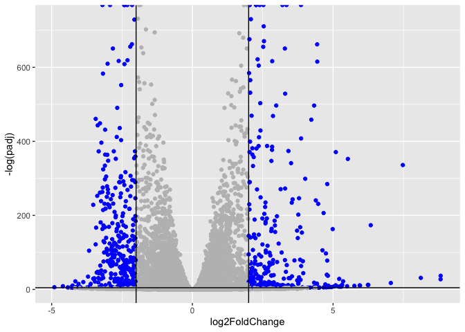
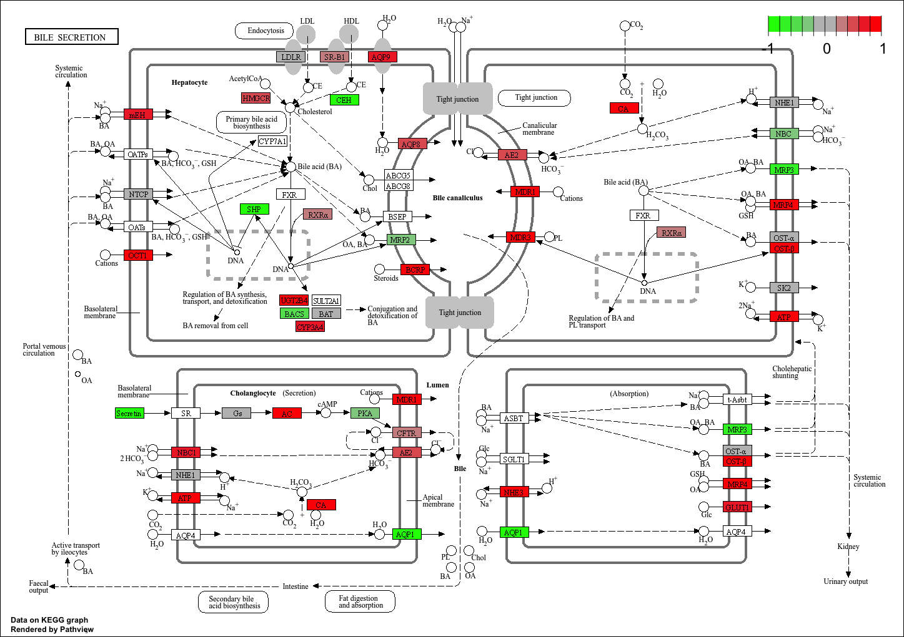

# Class 14: RNA-Seq Analysis Mini-Project
Katherine Quach (A18541014)

- [Background](#background)
- [Data Import](#data-import)
- [Check and Tidy](#check-and-tidy)
- [Setup for DESeq2](#setup-for-deseq2)
- [Runing DESeq2](#runing-deseq2)
- [Results](#results)
- [Volcano plot](#volcano-plot)
- [Add annotation](#add-annotation)
- [Save annotated results](#save-annotated-results)
- [Pathway Analysis](#pathway-analysis)
- [Gene Ontology (GO) Analysis](#gene-ontology-go-analysis)
- [Reactome Analysis](#reactome-analysis)

## Background

Our Data for today comes from a HOX gene knock-out study

> Trapnell C, Hendrickson DG, Sauvageau M, Goff L et al. “Differential
> analysis of gene regulation at transcript resolution with RNA-seq”.
> Nat Biotechnol 2013 Jan;31(1):46-53. PMID: 23222703

The authors report on differential analysis of lung fibroblasts in
response to loss of the developmental transcription factor HOXA1.

## Data Import

We have 2 key input files: counts and metadata.

``` r
library(DESeq2)
```

    Loading required package: S4Vectors

    Loading required package: stats4

    Loading required package: BiocGenerics

    Loading required package: generics


    Attaching package: 'generics'

    The following objects are masked from 'package:base':

        as.difftime, as.factor, as.ordered, intersect, is.element, setdiff,
        setequal, union


    Attaching package: 'BiocGenerics'

    The following objects are masked from 'package:stats':

        IQR, mad, sd, var, xtabs

    The following objects are masked from 'package:base':

        anyDuplicated, aperm, append, as.data.frame, basename, cbind,
        colnames, dirname, do.call, duplicated, eval, evalq, Filter, Find,
        get, grep, grepl, is.unsorted, lapply, Map, mapply, match, mget,
        order, paste, pmax, pmax.int, pmin, pmin.int, Position, rank,
        rbind, Reduce, rownames, sapply, saveRDS, table, tapply, unique,
        unsplit, which.max, which.min


    Attaching package: 'S4Vectors'

    The following object is masked from 'package:utils':

        findMatches

    The following objects are masked from 'package:base':

        expand.grid, I, unname

    Loading required package: IRanges

    Loading required package: GenomicRanges

    Loading required package: Seqinfo

    Loading required package: SummarizedExperiment

    Loading required package: MatrixGenerics

    Loading required package: matrixStats


    Attaching package: 'MatrixGenerics'

    The following objects are masked from 'package:matrixStats':

        colAlls, colAnyNAs, colAnys, colAvgsPerRowSet, colCollapse,
        colCounts, colCummaxs, colCummins, colCumprods, colCumsums,
        colDiffs, colIQRDiffs, colIQRs, colLogSumExps, colMadDiffs,
        colMads, colMaxs, colMeans2, colMedians, colMins, colOrderStats,
        colProds, colQuantiles, colRanges, colRanks, colSdDiffs, colSds,
        colSums2, colTabulates, colVarDiffs, colVars, colWeightedMads,
        colWeightedMeans, colWeightedMedians, colWeightedSds,
        colWeightedVars, rowAlls, rowAnyNAs, rowAnys, rowAvgsPerColSet,
        rowCollapse, rowCounts, rowCummaxs, rowCummins, rowCumprods,
        rowCumsums, rowDiffs, rowIQRDiffs, rowIQRs, rowLogSumExps,
        rowMadDiffs, rowMads, rowMaxs, rowMeans2, rowMedians, rowMins,
        rowOrderStats, rowProds, rowQuantiles, rowRanges, rowRanks,
        rowSdDiffs, rowSds, rowSums2, rowTabulates, rowVarDiffs, rowVars,
        rowWeightedMads, rowWeightedMeans, rowWeightedMedians,
        rowWeightedSds, rowWeightedVars

    Loading required package: Biobase

    Welcome to Bioconductor

        Vignettes contain introductory material; view with
        'browseVignettes()'. To cite Bioconductor, see
        'citation("Biobase")', and for packages 'citation("pkgname")'.


    Attaching package: 'Biobase'

    The following object is masked from 'package:MatrixGenerics':

        rowMedians

    The following objects are masked from 'package:matrixStats':

        anyMissing, rowMedians

``` r
metaFile <- "data/GSE37704_metadata.csv"
countFile <- "data/GSE37704_featurecounts.csv"

# Import metadata and take a peek
colData = read.csv("GSE37704_metadata.csv", row.names=1)
head(colData)
```

                  condition
    SRR493366 control_sirna
    SRR493367 control_sirna
    SRR493368 control_sirna
    SRR493369      hoxa1_kd
    SRR493370      hoxa1_kd
    SRR493371      hoxa1_kd

``` r
# Import countdata
countData = read.csv("GSE37704_featurecounts.csv", row.names=1)
head(countData)
```

                    length SRR493366 SRR493367 SRR493368 SRR493369 SRR493370
    ENSG00000186092    918         0         0         0         0         0
    ENSG00000279928    718         0         0         0         0         0
    ENSG00000279457   1982        23        28        29        29        28
    ENSG00000278566    939         0         0         0         0         0
    ENSG00000273547    939         0         0         0         0         0
    ENSG00000187634   3214       124       123       205       207       212
                    SRR493371
    ENSG00000186092         0
    ENSG00000279928         0
    ENSG00000279457        46
    ENSG00000278566         0
    ENSG00000273547         0
    ENSG00000187634       258

``` r
head(countData)
```

                    length SRR493366 SRR493367 SRR493368 SRR493369 SRR493370
    ENSG00000186092    918         0         0         0         0         0
    ENSG00000279928    718         0         0         0         0         0
    ENSG00000279457   1982        23        28        29        29        28
    ENSG00000278566    939         0         0         0         0         0
    ENSG00000273547    939         0         0         0         0         0
    ENSG00000187634   3214       124       123       205       207       212
                    SRR493371
    ENSG00000186092         0
    ENSG00000279928         0
    ENSG00000279457        46
    ENSG00000278566         0
    ENSG00000273547         0
    ENSG00000187634       258

> Q. Complete the code below to remove the troublesome first column from
> countData

We need to remove the first length column from `countdata` to have a 1:1
corespondents with `colData` rows.

``` r
countData <- countData[,-1]
```

> Q. Complete the code below to filter countData to exclude genes
> (i.e. rows) where we have 0 read count across all samples
> (i.e. columns).

``` r
rownames(colData) == colnames(countData)
```

    [1] TRUE TRUE TRUE TRUE TRUE TRUE

Tip: What will rowSums() of countData return and how could you use it in
this context?

``` r
# Filter count data where you have 0 read count across all samples.
# countData = countData[rowSums(countData) > 0,]
# head(countData)
```

## Check and Tidy

``` r
library(DESeq2)
```

## Setup for DESeq2

``` r
dds <- DESeqDataSetFromMatrix(countData = countData,
                              colData = colData,
                              design = ~condition)
```

    Warning in DESeqDataSet(se, design = design, ignoreRank): some variables in
    design formula are characters, converting to factors

## Runing DESeq2

``` r
dds <- DESeq(dds)
```

    estimating size factors

    estimating dispersions

    gene-wise dispersion estimates

    mean-dispersion relationship

    final dispersion estimates

    fitting model and testing

``` r
dds
```

    class: DESeqDataSet 
    dim: 19808 6 
    metadata(1): version
    assays(4): counts mu H cooks
    rownames(19808): ENSG00000186092 ENSG00000279928 ... ENSG00000277475
      ENSG00000268674
    rowData names(22): baseMean baseVar ... deviance maxCooks
    colnames(6): SRR493366 SRR493367 ... SRR493370 SRR493371
    colData names(2): condition sizeFactor

``` r
resultsNames(dds)
```

    [1] "Intercept"                           "condition_hoxa1_kd_vs_control_sirna"

## Results

``` r
res <- results(dds)
head(res)
```

    log2 fold change (MLE): condition hoxa1 kd vs control sirna 
    Wald test p-value: condition hoxa1 kd vs control sirna 
    DataFrame with 6 rows and 6 columns
                     baseMean log2FoldChange     lfcSE      stat     pvalue
                    <numeric>      <numeric> <numeric> <numeric>  <numeric>
    ENSG00000186092    0.0000             NA        NA        NA         NA
    ENSG00000279928    0.0000             NA        NA        NA         NA
    ENSG00000279457   29.9136       0.179257  0.324822  0.551863 0.58104205
    ENSG00000278566    0.0000             NA        NA        NA         NA
    ENSG00000273547    0.0000             NA        NA        NA         NA
    ENSG00000187634  183.2296       0.426457  0.140266  3.040350 0.00236304
                          padj
                     <numeric>
    ENSG00000186092         NA
    ENSG00000279928         NA
    ENSG00000279457 0.68707978
    ENSG00000278566         NA
    ENSG00000273547         NA
    ENSG00000187634 0.00516278

> Q. Call the summary() function on your results to get a sense of how
> many genes are up or down-regulated at the default 0.1 p-value cutoff.

``` r
summary(res)
```


    out of 15975 with nonzero total read count
    adjusted p-value < 0.1
    LFC > 0 (up)       : 4349, 27%
    LFC < 0 (down)     : 4393, 27%
    outliers [1]       : 0, 0%
    low counts [2]     : 1221, 7.6%
    (mean count < 0)
    [1] see 'cooksCutoff' argument of ?results
    [2] see 'independentFiltering' argument of ?results

## Volcano plot

``` r
library(ggplot2)

        ggplot(res) +
        aes(log2FoldChange, 
        -log(padj)) +
        geom_point()
```

    Warning: Removed 5054 rows containing missing values or values outside the scale range
    (`geom_point()`).


> Q. Improve this plot by completing the below code, which adds color,
> axis labels and cutoff lines:

Let’s add some color to this plot along with cutoff lines for
fold-change and P-value

``` r
# Make a color vector for all genes
mycols <- rep("gray", nrow(res))

# Color blue the genes with fold change above 2
mycols[abs(res$log2FoldChange) > 2] <- "blue"

# Color gray those with adjusted p-value more than 0.01
mycols[res$padj > 0.01] <- "gray"
```

``` r
ggplot(res) +
        aes(log2FoldChange, 
       -log(padj)) +
        geom_point(col = mycols) +
        geom_vline(xintercept = c(-2,2)) + 
        geom_hline(yintercept = -log(0.01))
```

    Warning: Removed 5054 rows containing missing values or values outside the scale range
    (`geom_point()`).



## Add annotation

> Q. Use the mapIDs() function multiple times to add SYMBOL, ENTREZID
> and GENENAME annotation to our results by completing the code below.

``` r
library("AnnotationDbi")
library("org.Hs.eg.db")
```

``` r
columns(org.Hs.eg.db)
```

     [1] "ACCNUM"       "ALIAS"        "ENSEMBL"      "ENSEMBLPROT"  "ENSEMBLTRANS"
     [6] "ENTREZID"     "ENZYME"       "EVIDENCE"     "EVIDENCEALL"  "GENENAME"    
    [11] "GENETYPE"     "GO"           "GOALL"        "IPI"          "MAP"         
    [16] "OMIM"         "ONTOLOGY"     "ONTOLOGYALL"  "PATH"         "PFAM"        
    [21] "PMID"         "PROSITE"      "REFSEQ"       "SYMBOL"       "UCSCKG"      
    [26] "UNIPROT"     

``` r
res$symbol = mapIds(org.Hs.eg.db,
                    keys=row.names(res), 
                    keytype="ENSEMBL",
                    column="SYMBOL",
                    multiVals="first")
```

    'select()' returned 1:many mapping between keys and columns

``` r
res$entrez = mapIds(org.Hs.eg.db,
                    keys=row.names(res),
                    keytype="ENSEMBL",
                    column="ENTREZID",
                    multiVals="first")
```

    'select()' returned 1:many mapping between keys and columns

``` r
res$name =   mapIds(org.Hs.eg.db,
                    keys=row.names(res),
                    keytype="ENSEMBL",
                    column="GENENAME",
                    multiVals="first")
```

    'select()' returned 1:many mapping between keys and columns

``` r
head(res, 10)
```

    log2 fold change (MLE): condition hoxa1 kd vs control sirna 
    Wald test p-value: condition hoxa1 kd vs control sirna 
    DataFrame with 10 rows and 9 columns
                     baseMean log2FoldChange     lfcSE       stat      pvalue
                    <numeric>      <numeric> <numeric>  <numeric>   <numeric>
    ENSG00000186092    0.0000             NA        NA         NA          NA
    ENSG00000279928    0.0000             NA        NA         NA          NA
    ENSG00000279457   29.9136      0.1792571 0.3248216   0.551863 5.81042e-01
    ENSG00000278566    0.0000             NA        NA         NA          NA
    ENSG00000273547    0.0000             NA        NA         NA          NA
    ENSG00000187634  183.2296      0.4264571 0.1402658   3.040350 2.36304e-03
    ENSG00000188976 1651.1881     -0.6927205 0.0548465 -12.630158 1.43990e-36
    ENSG00000187961  209.6379      0.7297556 0.1318599   5.534326 3.12428e-08
    ENSG00000187583   47.2551      0.0405765 0.2718928   0.149237 8.81366e-01
    ENSG00000187642   11.9798      0.5428105 0.5215598   1.040744 2.97994e-01
                           padj      symbol      entrez                   name
                      <numeric> <character> <character>            <character>
    ENSG00000186092          NA       OR4F5       79501 olfactory receptor f..
    ENSG00000279928          NA          NA          NA                     NA
    ENSG00000279457 6.87080e-01          NA          NA                     NA
    ENSG00000278566          NA          NA          NA                     NA
    ENSG00000273547          NA          NA          NA                     NA
    ENSG00000187634 5.16278e-03      SAMD11      148398 sterile alpha motif ..
    ENSG00000188976 1.76741e-35       NOC2L       26155 NOC2 like nucleolar ..
    ENSG00000187961 1.13536e-07      KLHL17      339451 kelch like family me..
    ENSG00000187583 9.18988e-01     PLEKHN1       84069 pleckstrin homology ..
    ENSG00000187642 4.03817e-01       PERM1       84808 PPARGC1 and ESRR ind..

## Save annotated results

> Q. Finally for this section let’s reorder these results by adjusted
> p-value and save them to a CSV file in your current project directory.

``` r
res = res[order(res$pvalue),]
write.csv(res, file = "results_annotated.csv")
```

## Pathway Analysis

``` r
library(gage)
library(gageData)
library(pathview)

data(kegg.sets.hs)
data(sigmet.idx.hs)

# Focus on signaling and metabolic pathways only
kegg.sets.hs = kegg.sets.hs[sigmet.idx.hs]

# Examine the first 3 pathways
head(kegg.sets.hs, 3)
```

    $`hsa00232 Caffeine metabolism`
    [1] "10"   "1544" "1548" "1549" "1553" "7498" "9"   

    $`hsa00983 Drug metabolism - other enzymes`
     [1] "10"     "1066"   "10720"  "10941"  "151531" "1548"   "1549"   "1551"  
     [9] "1553"   "1576"   "1577"   "1806"   "1807"   "1890"   "221223" "2990"  
    [17] "3251"   "3614"   "3615"   "3704"   "51733"  "54490"  "54575"  "54576" 
    [25] "54577"  "54578"  "54579"  "54600"  "54657"  "54658"  "54659"  "54963" 
    [33] "574537" "64816"  "7083"   "7084"   "7172"   "7363"   "7364"   "7365"  
    [41] "7366"   "7367"   "7371"   "7372"   "7378"   "7498"   "79799"  "83549" 
    [49] "8824"   "8833"   "9"      "978"   

    $`hsa00230 Purine metabolism`
      [1] "100"    "10201"  "10606"  "10621"  "10622"  "10623"  "107"    "10714" 
      [9] "108"    "10846"  "109"    "111"    "11128"  "11164"  "112"    "113"   
     [17] "114"    "115"    "122481" "122622" "124583" "132"    "158"    "159"   
     [25] "1633"   "171568" "1716"   "196883" "203"    "204"    "205"    "221823"
     [33] "2272"   "22978"  "23649"  "246721" "25885"  "2618"   "26289"  "270"   
     [41] "271"    "27115"  "272"    "2766"   "2977"   "2982"   "2983"   "2984"  
     [49] "2986"   "2987"   "29922"  "3000"   "30833"  "30834"  "318"    "3251"  
     [57] "353"    "3614"   "3615"   "3704"   "377841" "471"    "4830"   "4831"  
     [65] "4832"   "4833"   "4860"   "4881"   "4882"   "4907"   "50484"  "50940" 
     [73] "51082"  "51251"  "51292"  "5136"   "5137"   "5138"   "5139"   "5140"  
     [81] "5141"   "5142"   "5143"   "5144"   "5145"   "5146"   "5147"   "5148"  
     [89] "5149"   "5150"   "5151"   "5152"   "5153"   "5158"   "5167"   "5169"  
     [97] "51728"  "5198"   "5236"   "5313"   "5315"   "53343"  "54107"  "5422"  
    [105] "5424"   "5425"   "5426"   "5427"   "5430"   "5431"   "5432"   "5433"  
    [113] "5434"   "5435"   "5436"   "5437"   "5438"   "5439"   "5440"   "5441"  
    [121] "5471"   "548644" "55276"  "5557"   "5558"   "55703"  "55811"  "55821" 
    [129] "5631"   "5634"   "56655"  "56953"  "56985"  "57804"  "58497"  "6240"  
    [137] "6241"   "64425"  "646625" "654364" "661"    "7498"   "8382"   "84172" 
    [145] "84265"  "84284"  "84618"  "8622"   "8654"   "87178"  "8833"   "9060"  
    [153] "9061"   "93034"  "953"    "9533"   "954"    "955"    "956"    "957"   
    [161] "9583"   "9615"  

``` r
foldchanges = res$log2FoldChange
names(foldchanges) = res$entrez
head(foldchanges)
```

         1266     54855      1465      2034      2150      6659 
    -2.422719  3.201955 -2.313738 -1.888019  3.344508  2.392288 

``` r
# Get the results
keggres <- gage(foldchanges, gsets=kegg.sets.hs)

attributes(keggres)
```

    $names
    [1] "greater" "less"    "stats"  

``` r
# Look at the first few down (less) pathways
head(keggres$less)
```

                                             p.geomean stat.mean        p.val
    hsa04110 Cell cycle                   7.077982e-06 -4.432593 7.077982e-06
    hsa03030 DNA replication              9.424076e-05 -3.951803 9.424076e-05
    hsa03013 RNA transport                1.160132e-03 -3.080629 1.160132e-03
    hsa04114 Oocyte meiosis               2.563806e-03 -2.827297 2.563806e-03
    hsa03440 Homologous recombination     3.066756e-03 -2.852899 3.066756e-03
    hsa00010 Glycolysis / Gluconeogenesis 4.360092e-03 -2.663825 4.360092e-03
                                                q.val set.size         exp1
    hsa04110 Cell cycle                   0.001160789      124 7.077982e-06
    hsa03030 DNA replication              0.007727742       36 9.424076e-05
    hsa03013 RNA transport                0.063420543      149 1.160132e-03
    hsa04114 Oocyte meiosis               0.100589607      112 2.563806e-03
    hsa03440 Homologous recombination     0.100589607       28 3.066756e-03
    hsa00010 Glycolysis / Gluconeogenesis 0.119175854       65 4.360092e-03

``` r
pathview(gene.data=foldchanges, pathway.id="hsa04110")
```

    Info: Downloading xml files for hsa04110, 1/1 pathways..

    Info: Downloading png files for hsa04110, 1/1 pathways..

    'select()' returned 1:1 mapping between keys and columns

    Info: Working in directory /Users/katherinequach/Desktop/bimm143/Week7

    Info: Writing image file hsa04110.pathview.png

``` r
# A different PDF based output of the same data
pathview(gene.data=foldchanges, pathway.id="hsa04110", kegg.native=FALSE)
```

    'select()' returned 1:1 mapping between keys and columns

    Warning: reconcile groups sharing member nodes!

         [,1] [,2] 
    [1,] "9"  "300"
    [2,] "9"  "306"

    Info: Working in directory /Users/katherinequach/Desktop/bimm143/Week7

    Info: Writing image file hsa04110.pathview.pdf


``` r
# Focus on top 5 upregulated pathways here for demo purposes only
keggrespathways <- rownames(keggres$greater)[1:5]

# Extract the 8 character long IDs part of each string
keggresids = substr(keggrespathways, start=1, stop=8)
keggresids
```

    [1] "hsa04740" "hsa04640" "hsa00140" "hsa04630" "hsa04976"

``` r
pathview(gene.data=foldchanges, pathway.id=keggresids, species="hsa")
```

    Info: Downloading xml files for hsa04740, 1/1 pathways..

    Info: Downloading png files for hsa04740, 1/1 pathways..

    'select()' returned 1:1 mapping between keys and columns

    Info: Working in directory /Users/katherinequach/Desktop/bimm143/Week7

    Info: Writing image file hsa04740.pathview.png

    Info: Downloading xml files for hsa04640, 1/1 pathways..

    Info: Downloading png files for hsa04640, 1/1 pathways..

    'select()' returned 1:1 mapping between keys and columns

    Info: Working in directory /Users/katherinequach/Desktop/bimm143/Week7

    Info: Writing image file hsa04640.pathview.png

    Info: Downloading xml files for hsa00140, 1/1 pathways..

    Info: Downloading png files for hsa00140, 1/1 pathways..

    'select()' returned 1:1 mapping between keys and columns

    Info: Working in directory /Users/katherinequach/Desktop/bimm143/Week7

    Info: Writing image file hsa00140.pathview.png

    Info: Downloading xml files for hsa04630, 1/1 pathways..

    Info: Downloading png files for hsa04630, 1/1 pathways..

    'select()' returned 1:1 mapping between keys and columns

    Info: Working in directory /Users/katherinequach/Desktop/bimm143/Week7

    Info: Writing image file hsa04630.pathview.png

    Info: Downloading xml files for hsa04976, 1/1 pathways..

    Info: Downloading png files for hsa04976, 1/1 pathways..

    'select()' returned 1:1 mapping between keys and columns

    Info: Working in directory /Users/katherinequach/Desktop/bimm143/Week7

    Info: Writing image file hsa04976.pathview.png




> Q. Can you do the same procedure as above to plot the pathview figures
> for the top 5 down-regulated pathways?

``` r
## Focus on top 5 upregulated pathways here for demo purposes only
keggrespathways <- rownames(keggres$less)[1:5]

# Extract the 8 character long IDs part of each string
keggresids = substr(keggrespathways, start=1, stop=8)
keggresids
```

    [1] "hsa04110" "hsa03030" "hsa03013" "hsa04114" "hsa03440"

``` r
pathview(gene.data=foldchanges, pathway.id="hsa04110")
```

    'select()' returned 1:1 mapping between keys and columns

    Info: Working in directory /Users/katherinequach/Desktop/bimm143/Week7

    Info: Writing image file hsa04110.pathview.png

``` r
pathview(gene.data=foldchanges, pathway.id="hsa03030")
```

    Info: Downloading xml files for hsa03030, 1/1 pathways..

    Info: Downloading png files for hsa03030, 1/1 pathways..

    'select()' returned 1:1 mapping between keys and columns

    Info: Working in directory /Users/katherinequach/Desktop/bimm143/Week7

    Info: Writing image file hsa03030.pathview.png

``` r
pathview(gene.data=foldchanges, pathway.id="hsa03013")
```

    Info: Downloading xml files for hsa03013, 1/1 pathways..

    Info: Downloading png files for hsa03013, 1/1 pathways..

    'select()' returned 1:1 mapping between keys and columns

    Info: Working in directory /Users/katherinequach/Desktop/bimm143/Week7

    Info: Writing image file hsa03013.pathview.png

``` r
pathview(gene.data=foldchanges, pathway.id="hsa04114")
```

    Info: Downloading xml files for hsa04114, 1/1 pathways..

    Info: Downloading png files for hsa04114, 1/1 pathways..

    'select()' returned 1:1 mapping between keys and columns

    Info: Working in directory /Users/katherinequach/Desktop/bimm143/Week7

    Info: Writing image file hsa04114.pathview.png

``` r
pathview(gene.data=foldchanges, pathway.id="hsa03440")
```

    Info: Downloading xml files for hsa03440, 1/1 pathways..

    Info: Downloading png files for hsa03440, 1/1 pathways..

    'select()' returned 1:1 mapping between keys and columns

    Info: Working in directory /Users/katherinequach/Desktop/bimm143/Week7

    Info: Writing image file hsa03440.pathview.png


## Gene Ontology (GO) Analysis

``` r
data(go.sets.hs)
data(go.subs.hs)

# Focus on Biological Process subset of GO
gobpsets = go.sets.hs[go.subs.hs$BP]

gobpres = gage(foldchanges, gsets=gobpsets)

lapply(gobpres, head)
```

    $greater
                                                  p.geomean stat.mean        p.val
    GO:0007156 homophilic cell adhesion        1.734864e-05  4.210777 1.734864e-05
    GO:0048729 tissue morphogenesis            5.407952e-05  3.888470 5.407952e-05
    GO:0002009 morphogenesis of an epithelium  5.727599e-05  3.878706 5.727599e-05
    GO:0030855 epithelial cell differentiation 2.053700e-04  3.554776 2.053700e-04
    GO:0060562 epithelial tube morphogenesis   2.927804e-04  3.458463 2.927804e-04
    GO:0048598 embryonic morphogenesis         2.959270e-04  3.446527 2.959270e-04
                                                    q.val set.size         exp1
    GO:0007156 homophilic cell adhesion        0.07584825      137 1.734864e-05
    GO:0048729 tissue morphogenesis            0.08347021      483 5.407952e-05
    GO:0002009 morphogenesis of an epithelium  0.08347021      382 5.727599e-05
    GO:0030855 epithelial cell differentiation 0.16449701      299 2.053700e-04
    GO:0060562 epithelial tube morphogenesis   0.16449701      289 2.927804e-04
    GO:0048598 embryonic morphogenesis         0.16449701      498 2.959270e-04

    $less
                                                p.geomean stat.mean        p.val
    GO:0048285 organelle fission             6.626774e-16 -8.170439 6.626774e-16
    GO:0000280 nuclear division              1.797050e-15 -8.051200 1.797050e-15
    GO:0007067 mitosis                       1.797050e-15 -8.051200 1.797050e-15
    GO:0000087 M phase of mitotic cell cycle 4.757263e-15 -7.915080 4.757263e-15
    GO:0007059 chromosome segregation        1.081862e-11 -6.974546 1.081862e-11
    GO:0051301 cell division                 8.718528e-11 -6.455491 8.718528e-11
                                                    q.val set.size         exp1
    GO:0048285 organelle fission             2.618901e-12      386 6.626774e-16
    GO:0000280 nuclear division              2.618901e-12      362 1.797050e-15
    GO:0007067 mitosis                       2.618901e-12      362 1.797050e-15
    GO:0000087 M phase of mitotic cell cycle 5.199689e-12      373 4.757263e-15
    GO:0007059 chromosome segregation        9.459800e-09      146 1.081862e-11
    GO:0051301 cell division                 6.352901e-08      479 8.718528e-11

    $stats
                                               stat.mean     exp1
    GO:0007156 homophilic cell adhesion         4.210777 4.210777
    GO:0048729 tissue morphogenesis             3.888470 3.888470
    GO:0002009 morphogenesis of an epithelium   3.878706 3.878706
    GO:0030855 epithelial cell differentiation  3.554776 3.554776
    GO:0060562 epithelial tube morphogenesis    3.458463 3.458463
    GO:0048598 embryonic morphogenesis          3.446527 3.446527

## Reactome Analysis

``` r
sig_genes <- res[res$padj <= 0.05 & !is.na(res$padj), "symbol"]
print(paste("Total number of significant genes:", length(sig_genes)))
```

    [1] "Total number of significant genes: 8146"

``` r
write.table(sig_genes, file="significant_genes.txt", row.names=FALSE, col.names=FALSE, quote=FALSE)
```

Figure from Reactome:


> Q. What pathway has the most significant “Entities p-value”? Do the
> most significant pathways listed match your previous KEGG results?
> What factors could cause differences between the two methods?

The pathway with the most significant “Entities p-value” is Response of
EIF2AK4 (GCN2) to amino acid deficiency with a p-value of 7.1E-3. The
most significant pathways include Cell Cycle, Mitotic, or DNA
Replication, which match the previous KEGG results (which highlighted
“Cell Cycle” and “DNA Replication” as the top down-regulated pathways).
Factors that would’ve caused these differences between the 2 methods are
differences in how each database is created, where the specific
hierarchical strucure of the pathway maps and unique gene-to-pathway
assignment requirements differ (Reactome vs. the KEGG database). These
may include data annotation differences, pathway definitions, and gene
coverage.

``` r
sessionInfo()
```

    R version 4.5.3 (2026-03-11)
    Platform: x86_64-apple-darwin20
    Running under: macOS Monterey 12.7.6

    Matrix products: default
    BLAS:   /Library/Frameworks/R.framework/Versions/4.5-x86_64/Resources/lib/libRblas.0.dylib 
    LAPACK: /Library/Frameworks/R.framework/Versions/4.5-x86_64/Resources/lib/libRlapack.dylib;  LAPACK version 3.12.1

    locale:
    [1] en_US.UTF-8/en_US.UTF-8/en_US.UTF-8/C/en_US.UTF-8/en_US.UTF-8

    time zone: America/Los_Angeles
    tzcode source: internal

    attached base packages:
    [1] stats4    stats     graphics  grDevices utils     datasets  methods  
    [8] base     

    other attached packages:
     [1] pathview_1.50.0             gageData_2.48.0            
     [3] gage_2.60.0                 org.Hs.eg.db_3.22.0        
     [5] AnnotationDbi_1.72.0        ggplot2_4.0.2              
     [7] DESeq2_1.50.2               SummarizedExperiment_1.40.0
     [9] Biobase_2.70.0              MatrixGenerics_1.22.0      
    [11] matrixStats_1.5.0           GenomicRanges_1.62.1       
    [13] Seqinfo_1.0.0               IRanges_2.44.0             
    [15] S4Vectors_0.48.0            BiocGenerics_0.56.0        
    [17] generics_0.1.4             

    loaded via a namespace (and not attached):
     [1] KEGGREST_1.50.0     gtable_0.3.6        xfun_0.56          
     [4] lattice_0.22-9      bitops_1.0-9        vctrs_0.7.1        
     [7] tools_4.5.3         parallel_4.5.3      tibble_3.3.1       
    [10] RSQLite_2.4.6       blob_1.3.0          pkgconfig_2.0.3    
    [13] Matrix_1.7-4        RColorBrewer_1.1-3  S7_0.2.1           
    [16] graph_1.88.1        lifecycle_1.0.5     compiler_4.5.3     
    [19] farver_2.1.2        Biostrings_2.78.0   codetools_0.2-20   
    [22] htmltools_0.5.9     RCurl_1.98-1.17     yaml_2.3.12        
    [25] GO.db_3.22.0        crayon_1.5.3        pillar_1.11.1      
    [28] BiocParallel_1.44.0 DelayedArray_0.36.0 cachem_1.1.0       
    [31] abind_1.4-8         tidyselect_1.2.1    locfit_1.5-9.12    
    [34] digest_0.6.39       dplyr_1.2.0         labeling_0.4.3     
    [37] fastmap_1.2.0       grid_4.5.3          cli_3.6.5          
    [40] SparseArray_1.10.9  magrittr_2.0.4      S4Arrays_1.10.1    
    [43] XML_3.99-0.22       withr_3.0.2         scales_1.4.0       
    [46] bit64_4.6.0-1       rmarkdown_2.30      XVector_0.50.0     
    [49] httr_1.4.8          bit_4.6.0           otel_0.2.0         
    [52] png_0.1-8           memoise_2.0.1       evaluate_1.0.5     
    [55] knitr_1.51          rlang_1.1.7         Rcpp_1.1.1         
    [58] glue_1.8.0          DBI_1.3.0           Rgraphviz_2.54.0   
    [61] KEGGgraph_1.70.0    rstudioapi_0.18.0   jsonlite_2.0.0     
    [64] R6_2.6.1           
