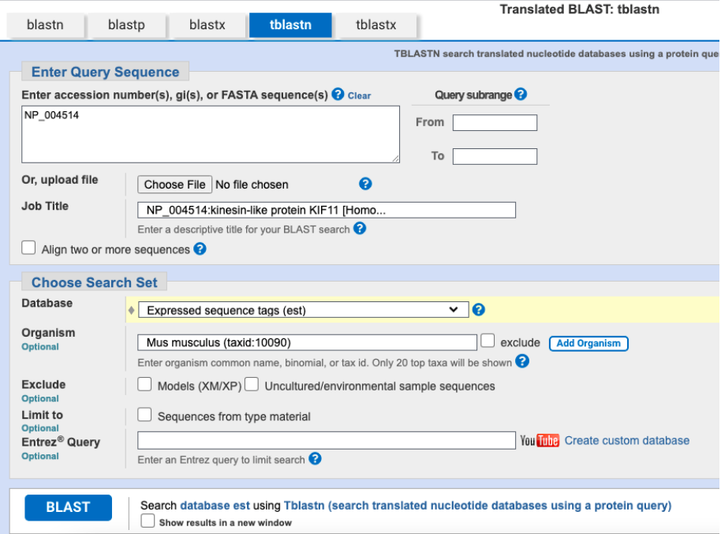
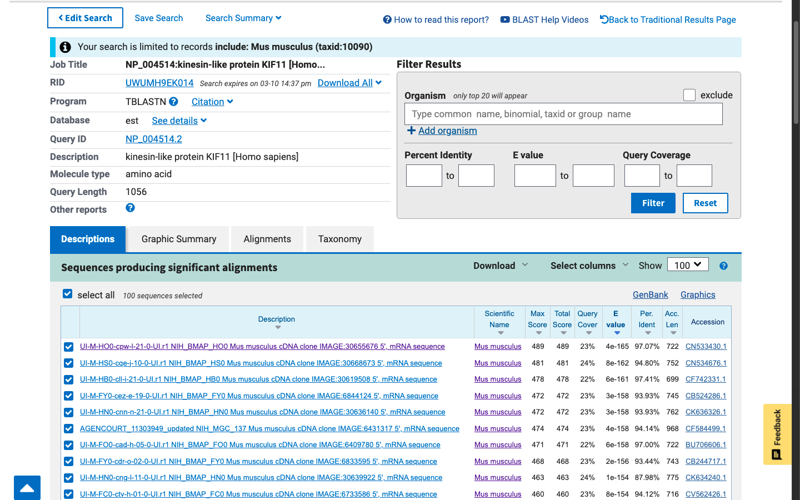
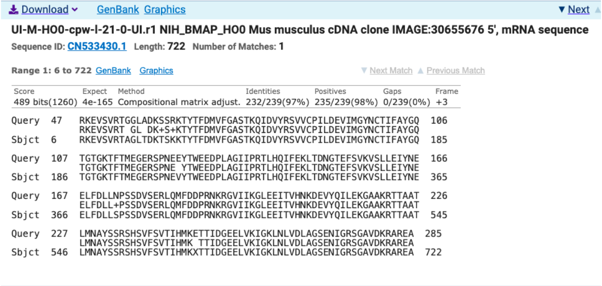
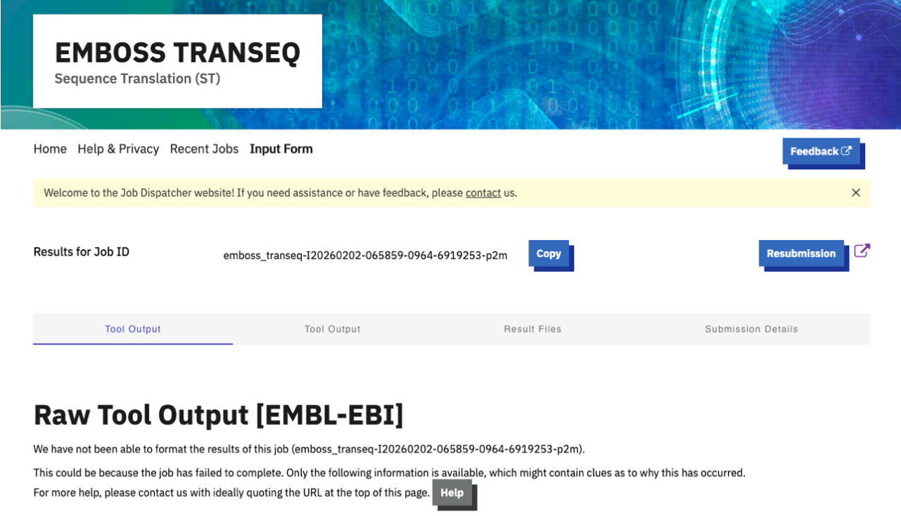
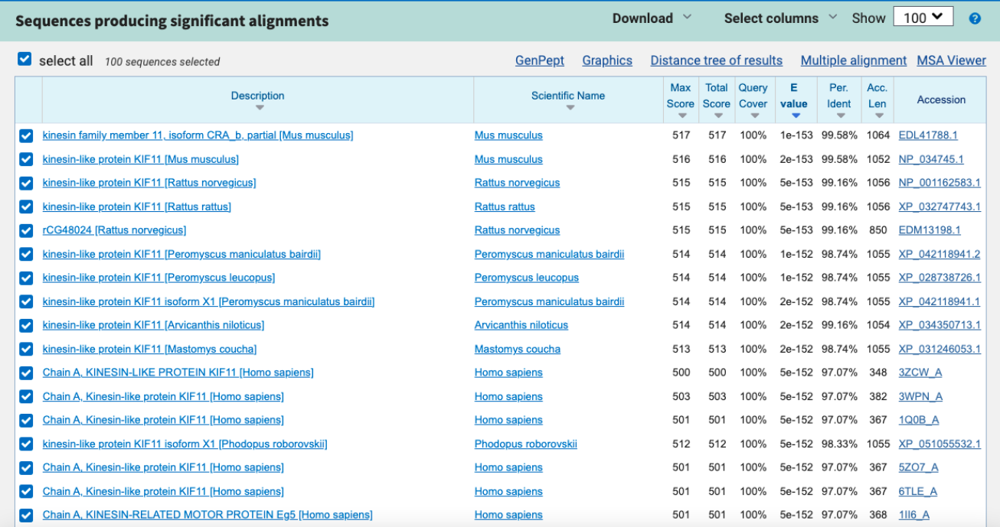
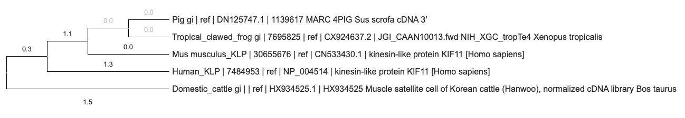
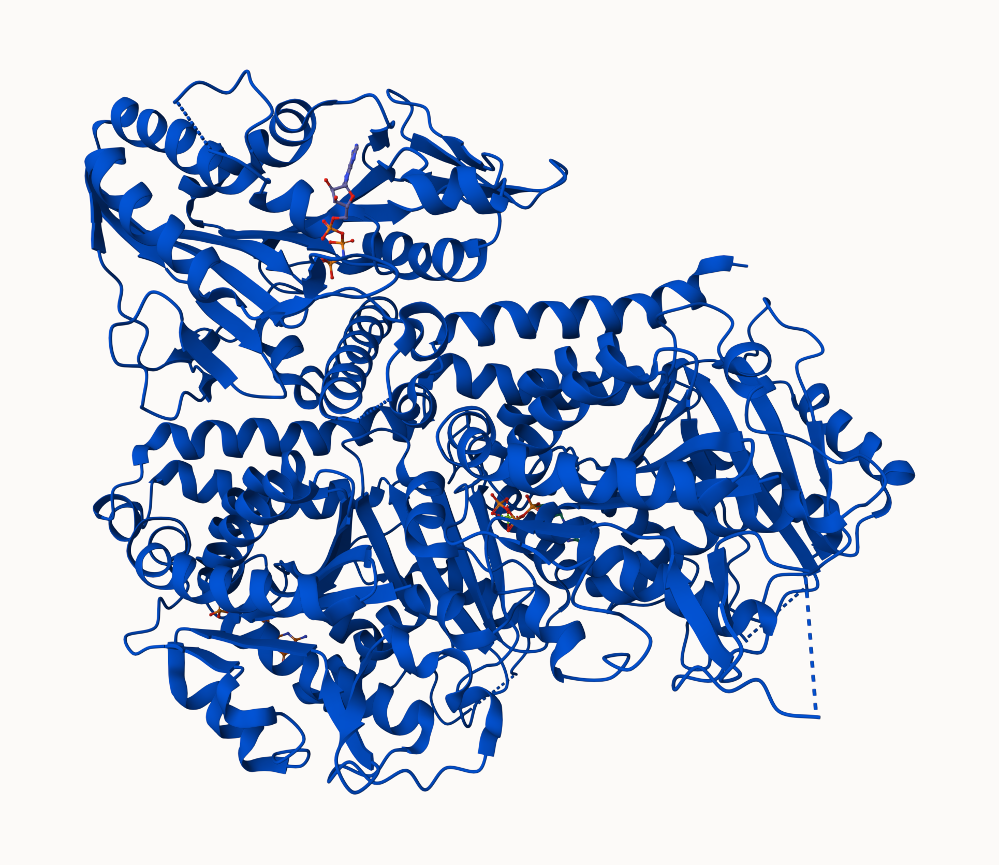
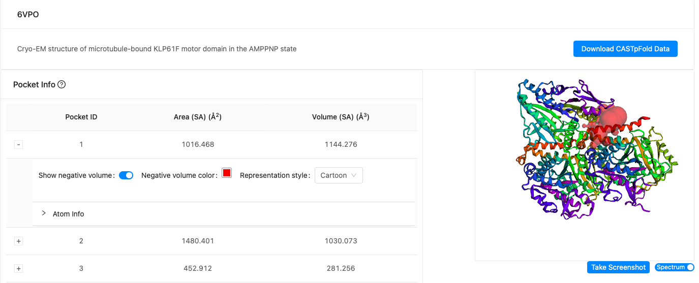
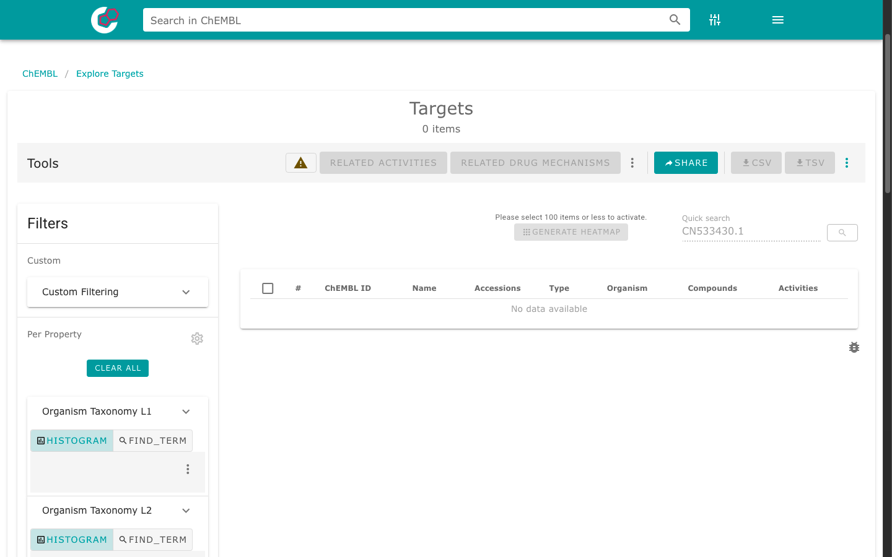

## Q1. Tell me the name of a protein you are interested in. Include the species and the accession number. This can be a human protein or a protein from any other species as long as it’s function is known.

**Name:** kinesin family member 11 

**Accession:** NP_004514 

**Species:** Homo sapiens 1

**Function:** Enables ATP, microtubule, nucleotide, protein, and protein kinase binding. It also enables microtubule and plus-end-directed microtubule motor activities.


## Q2. Perform a BLAST search against a DNA database, such as a database consisting of genomic DNA or ESTs. The BLAST server can be at NCBI or elsewhere. Include details of the BLAST method used, database searched and any limits applied (e.g. Organism).

**Method:** TBLASTN search against Mus musculus (House mouse) ESTs Database: Expressed Sequence Tags (est)

**Organism:** Mus musculus (taxid:10090)





**Chosen Match:** Accession CN533430.1, a 722 base pair clone from Mus musculus.




## Q3. Gather information about this “novel” protein. At a minimum, show me the protein sequence of the “novel” protein as displayed in your BLAST results from [Q2] as FASTA format (you can copy and paste the aligned sequence subject lines from your BLAST result page if necessary) or translate your novel DNA sequence using a tool called EMBOSS Transeq at the EBI. Don’t forget to translate all six reading frames; the ORF (open reading frame) is likely to be the longest sequence without a stop codon. It may not start with a methionine if you don’t have the complete coding region. Make sure the sequence you provide includes a header/subject line and is in traditional FASTA format.

**Chosen Sequence (FASTA Format):** >CN533430.1 UI-M-HO0-cpw-l-21-0-UI.r1 NIH_BMAP_HO0 Mus musculus cDNA clone IMAGE:30655676 5’, mRNA sequence 

RKEVSVRTAGLTDKTSKKTYTFDMVFGASTKQIDVYRSVVCPILDEVIMGYNCTIFAYGQTGTGKTFTMEGERSPNEVYTWEEDPLAGIIPRTLHQIFEKLTDNGTEFSVKVSLLEIYNEELFDLLSPSSDVSERLQMFDDPRNKRGVIIKGLEEITVHNKDEVYQILEKGAAKRTTAATLMNAYSSRSHSVFSVTIHMKXTTIDGEELVKIGKLNLVDLAGSENIGRSGAVDKRAREA

**Protein Name:** UI-M-HO0-cpw-l-21-0-UI.r1 NIH_BMAP_HO0 Mus musculus cDNA clone IMAGE:30655676 5’, mRNA sequence

**Species:** Mus musculus Eukaryota; Metazoa; Chordata; Craniata; Vertebrata; Euteleostomi; Mammalia; Eutheria; Euarchontoglires; Glires; Rodentia; Myomorpha; Muroidea; Muridae; Murinae; Mus; Mus.




## Q4. Prove that this gene, and its corresponding protein, are novel. For the purposes of this project, “novel” is defined as follows. Take the protein sequence (your answer to [Q3]), and use it as a query in a blastp search of the nr database at NCBI.

**Description:** A BLASTP search against NR database yielded a top hit result to a protein from Rattus norvegicus (NP_001162583.1).

**Species:** Rattus norvegicus

**Name:** kinesin-like protein KIF11 [Rattus norvegicus]
Percent Identity: 99.16%. Since the top match has less than 100% identity, this must mean the protein is novel because there is no identical match that is 100% to this specific species in the protein database.




## Q5. Generate a multiple sequence alignment with your novel protein, your original
query protein, and a group of other members of this family from different species. A
typical number of proteins to use in a multiple sequence alignment for this assignment
purpose is a minimum of 5 and a maximum of 20 - although the exact number is up to
you. Include the multiple sequence alignment in your report. Use Courier font with a size
appropriate to fit page width.

Side-note: Indicate your sequence in the alignment by choosing an appropriate name
for each sequence in the input unaligned sequence file (i.e. edit the sequence file so
that the species, or short common, names (rather than accession numbers) display in
the output alignment and in the subsequent answers below). The goal in this step is to
create an interesting an alignment for building a phylogenetic tree that illustrates
species divergence.

**Re-labeled sequences for alignment:**
1. Human_KLP | 7484953 | ref | NP_004514 | kinesin-like protein KIF11 [Homo sapiens]

VQENIQQKSKDIVNKMTFHSQKFCADSDGFSQELRNFNQEGTKLVEESVKHSDKLNGNLEKISQETEQRCESLNTRTVYFSEQWVSSLNEREQELHNLLEVVSQCCEASSSDITEKSDGRKAAHEKQHNIFLDQMTIDEDKLIAQNLELNETIKIGLTKLNCFLEQDLKLDIPTGTTPQRKSYLYPSTLVRTEPREHLLDQLKRKQPELLMMLNCSENNKEETIPDVDVEEAVLGQYTEEPLSQEPSVDAGVDCSSIGGVPFFQHKKSHGKDKE

2. Mus musculus_KLP | 30655676 | ref | CN533430.1 | kinesin-like protein KIF11 [Homo sapiens]

RKEVSVRTAGLTDKTSKKTYTFDMVFGASTKQIDVYRSVVCPILDEVIMGYNCTIFAYGQTGTGKTFTMEGERSPNEVYTWEEDPLAGIIPRTLHQIFEKLTDNGTEFSVKVSLLEIYNEELFDLLSPSSDVSERLQMFDDPRNKRGVIIKGLEEITVHNKDEVYQILEKGAAKRTTAATLMNAYSSRSHSVFSVTIHMKXTTIDGEELVKIGKLNLVDLAGSENIGRSGAVDKRAREA

3. Pig gi | ref | DN125747.1 | 1139617 MARC 4PIG Sus scrofa cDNA 3'

GKTFTMEGERSPNEEYTWEEDPLAGIIPRTLHQIFEKLTDNGTEFSVKVSLLEIYNEELFDLLNPSSDVSERLQMFDDPRNKRGVIIKGLEEITVHNKDEVYQILEKGAAKRTTAATLMNAYSSRSHSVFSVTIHMKETTIDGEELVKIGKLNLVDLAGSENIGRSGAVDKRAREAGNINQSLLTLGRVITALVERTPHVPYRESKLTRILQDSLGGRTRTSIIATISPAslnleetlstleYAHRAKNILNKPEVNQKLTKKALIKEYTEEIERLKRDLAAARE

4. Tropical_clawed_frog gi | 7695825 | ref | CX924637.2 | JGI_CAAN10013.fwd NIH_XGC_tropTe4 Xenopus tropicalis

RKTYTFDMVFGASTKQIDVYRSVVCPILDEVIMGYNCTIFAYGQTGTGKTFTMEGERSPNEEYTWEEDPLAGIIPRTLHQIFEKLTDNGTEFSVKVSLLEIYNEELFDLLNPSSDVSERLQMFDDPRNKRGVIIKGLEEITVHNKDEVYQILEKGAAKRTTAATLMNAYSSRSHSVFSVTIHMKETTIDGEELVKIGKLNLVDLAGSENIGRSGAVDKRAREAGNINQSLLTLGRVITALVERTPHVPYRESKLTRILQDSL

5. Domestic_cattle gi | | ref | HX934525.1 | HX934525 Muscle satellite cell of Korean cattle (Hanwoo), normalized cDNA library Bos taurus

YAHRAKNILNKPEVNQKLTKKALIKEYTEEIERLKRDLAAAREKNGVYISEENFRVMSGKLTVQEEQIVELIEKIGAVEEELNRVTELFMDNKNELDQCKSDLQNKTQELETTQKHLQETKLQLVKEEYITSALESTEEKLHDAASKLLNTVEETTKDVSGLHSKLDRKKAVDQHNAEAQDIFGKNLNSLFNNMEELIKDGSSKQKAMLEVHKTLFGNLLSSSVSALDTITTVALGSLTSIPENVSTHVSQIFNMILKEQSLAAESKTVL

**Alignment: Obtained using MUSCLE (version 3.8) at EBI**

CLUSTAL multiple sequence alignment by MUSCLE (3.8)

```text
Domestic_cattle           ----------------YAHRAKNILNKPEVNQKLTKKALIKEYTEEIERLKRDLAAAREK
Human_KLP                 ------------VQENIQQKSKDIVNK---------------------MTFHSQKFCADS
Mus                       RKEVSVRTAGLTDKTSKKTYTFDMVFGASTKQIDVYRSVVCPILDEVIMGYNCTIFAYGQ
Pig                       ------------------------------------------------------------
Tropical_clawed_frog      ----------------RKTYTFDMVFGASTKQIDVYRSVVCPILDEVIMGYNCTIFAYGQ
                                                                                      

Domestic_cattle           NGVYISEENFRVMSGKLTVQEEQIVE--LIEKIGAVEEELNRVTELFMDNKNELDQC-KS
Human_KLP                 DGFSQELRNFN-QEGTKLVEESVKHSDKLNGNLEKISQETEQRCESLNTRTVYFSEQWVS
Mus                       TGTG---KTFT-MEGERSPNEVYTWEEDPLAGI--IPRTLHQIFEKLTDNGTEFSVK-VS
Pig                       ---G---KTFT-MEGERSPNEEYTWEEDPLAGI--IPRTLHQIFEKLTDNGTEFSVK-VS
Tropical_clawed_frog      TGTG---KTFT-MEGERSPNEEYTWEEDPLAGI--IPRTLHQIFEKLTDNGTEFSVK-VS
                                  .*   .*    :*    .      :  :     .  * :  .   :.    *

Domestic_cattle           DLQNKTQELETTQKHLQETKLQLVKEEYITSALESTEEKLHDAASKLLNTVEE-TTKDVS
Human_KLP                 SLNEREQELHNLLEVVSQCCEASSSD--ITEKSDGRKAA-HEKQHNIF--LDQMTIDEDK
Mus                       LLEIYNEELFDLLS--------PSSD--VSERLQMFDDP-RNKRGVIIKGLEEITVHNKD
Pig                       LLEIYNEELFDLLN--------PSSD--VSERLQMFDDP-RNKRGVIIKGLEEITVHNKD
Tropical_clawed_frog      LLEIYNEELFDLLN--------PSSD--VSERLQMFDDP-RNKRGVIIKGLEEITVHNKD
                           *:   :**    .          .:  ::.  :  .   .:    ::  ::: *  : .

Domestic_cattle           GLHSKLDRKKAVDQHNAEAQDIF--------------GKNLNSLFN------NMEELIKD
Human_KLP                 LIAQNLELNETIKI-GLTKLNCFLEQDLKLDIPTGTTPQRKSYLYPSTLVRTEPREHLLD
Mus                       EVYQILEKGAAKRTTAATLMNAY--------------SSRSHSVFSVTI---HMKXTTID
Pig                       EVYQILEKGAAKRTTAATLMNAY--------------SSRSHSVFSVTI---HMKETTID
Tropical_clawed_frog      EVYQILEKGAAKRTTAATLMNAY--------------SSRSHSVFSVTI---HMKETTID
                           : . *:   :         : :               ..   ::              *

Domestic_cattle           GSSKQKAMLEVHKTLFGNLLSSSVSALDTITTVALGSLTSIPENVSTHVSQIFNMILKEQ
Human_KLP                 QLKRKQPELLMMLNCSENNKEETIPDVD-VEEAVLGQYTEEPLSQEPSVDAGVDCSSIGG
Mus                       GEELVKIGKLNLVDLAGSENIGRSGAVD-KRAREA-------------------------
Pig                       GEELVKIGKLNLVDLAGSENIGRSGAVD-KRAREAGNINQSLLTLGRVITALVERTP--H
Tropical_clawed_frog      GEELVKIGKLNLVDLAGSENIGRSGAVD-KRAREAGNINQSLLTLGRVITALVERTP--H
                            .  :           .        :*                                

Domestic_cattle           SLAAESKTVL--------------------------------------------------
Human_KLP                 VPFFQHKKSHGKDKE---------------------------------------------
Mus                       ------------------------------------------------------------
Pig                       VPYRESKLTRILQDSLGGRTRTSIIATISPASLNLEETLSTLEYAHRAKNILNKPEVNQK
Tropical_clawed_frog      VPYRESKLTRILQDSL--------------------------------------------
                                                                                      

Domestic_cattle           --------------------------
Human_KLP                 --------------------------
Mus                       --------------------------
Pig                       LTKKALIKEYTEEIERLKRDLAAARE
Tropical_clawed_frog      --------------------------
```

## Q6. Create a phylogenetic tree, using either a parsimony or distance-based approach.
Bootstrapping and tree rooting are optional. Use “simple phylogeny” online from the EBI
or any respected phylogeny program (such as MEGA, PAUP, or Phylip). Paste an image
of your Cladogram or tree output in your report.




## Q7. Generate a sequence identity based heatmap of your aligned sequences using R.
If necessary convert your sequence alignment to the ubiquitous FASTA format (Seaview
can read in clustal format and “Save as” FASTA format for example). Read this FASTA
format alignment into R with the help of functions in the Bio3D package. Calculate a
sequence identity matrix (again using a function within the Bio3D package). Then
generate a heatmap plot and add to your report. Do make sure your labels are visible
and not cut at the figure margins.

```{r}
library(bio3d)
library(pheatmap)

aln <- read.fasta("Q7_Heatmap.fas")
ide_matrix <- seqidentity(aln)

pheatmap(
  ide_matrix,
  main = "RBM3 Sequence Identity",
  
  cluster_rows = FALSE,
  cluster_cols = FALSE,
  fontsize = 10,

  color = rev(heat.colors(100)),
  
  display_numbers = TRUE,
  number_format = "%.2f",
  number_color = "black",
  fontsize_number = 8,
  fontsize_row = 8,
  fontsize_col = 8,
)
```


## Q8. Using R/Bio3D (or an online blast server if you prefer), search the main protein
structure database for the most similar atomic resolution structures to your aligned
sequences.

List the top 3 unique hits (i.e. not hits representing different chains from the same
structure) along with their Evalue and sequence identity to your query. Please also add
annotation details of these structures. For example include the annotation terms PDB
identifier (structureId), Method used to solve the structure (experimentalTechnique),
resolution (resolution), and source organism (source).

```{r}
library(bio3d)

# Extract the first sequence (row 1) from the alignment object 'aln'. 'aln$ali' is a matrix of aligned sequences (rows = sequences, columns = positions)
seq_vec <- aln$ali[1, ]

# Collapse the vector of characters into a single string sequence and remove gap characters ("-") from the aligned sequence to get your query sequence
seq_str <- paste(seq_vec, collapse = "")
seq_str <- gsub("-", "", seq_str)

# Print the length of the ungapped query sequence and the first 50 residues of the query sequence as a quick preview
cat("Query length:", nchar(seq_str), "\n")
cat("Query preview:", substr(seq_str, 1, 50), "...\n")

# Run BLAST search against the PDB database using the query sequence
blast_results <- blast.pdb(seq_str)

# Extract the hit table from the BLAST results
hits <- blast_results$hit.tbl

# Derive the 4-character PDB structure ID from the 'pdb.id' field and remove duplicate entries based on structureId to keep only one hit per PDB structure
hits$structureId <- substr(hits$pdb.id, 1, 4)
unique_hits <- hits[!duplicated(hits$structureId), ]

# Select the top 3 unique PDB hits
top3 <- unique_hits[1:3, ]

# Retrieve annotation (metadata) for the top 3 PDB structure IDs
annot <- pdb.annotate(top3$structureId)

# Ensure the structureId column is present and explicitly named and remove duplicate annotations by structureId, keeping only unique structures
annot$structureId <- annot$structureId
annot_unique <- annot[!duplicated(annot$structureId), ]

# Match the order of annotations to the order of 'top3$structureId'. 'match' returns indices in 'annot_unique' corresponding to each structureId in 'top3'
idx <- match(top3$structureId, annot_unique$structureId)

# Subset the annotation table so rows align with the top3 hits
annot_sub <- annot_unique[idx, ]

# Make a table combining BLAST metrics and PDB annotations
result_table <- data.frame(
  structureId = top3$structureId,
  experimentalTechnique = annot_sub$experimentalTechnique,
  resolution = annot_sub$resolution,
  source = annot_sub$source,
  Evalue = top3$evalue,
  Identity = top3$identity
)
```

```{r}
print(result_table)
```


## Q9. Generate a molecular figure of one of your identified PDB structures using VMD.
You can optionally highlight conserved residues that are likely to be functional. Please
use a white or transparent background for your figure (i.e. not the default black).
Based on sequence similarity. 

**How likely is this structure to be similar to your “novel” protein?**


This protein is highly likely to be similar to my "novel" protein because it has a percent identity >90% (e.g. 95%).


## Q10

(i) Using your computed structure model (or your closest homologue of known
structure from the PDB) predict and locate potential small molecule binding sites using
the CASTpFold server (https://cfold.bme.uic.edu/castpfold/). Provide an image or
screen-shot of your largest predicted pockets “negative volume” and provide it’s area
and volume.



Area: 1016.468

Volume: 1144.276

(ii) Perform a “Target” search of ChEMBEL (https://www.ebi.ac.uk/chembl/) with your novel sequence. Are there any Target Associated Assays and ligand efficiency data reported that may be useful starting points for exploring potential inhibition of your novel protein?



A ChEMBL target search using my novel sequence (CN533430.1) returns no matching targets as of March 8, 2026 because there are no target-associated assays. This means that there are no ligand efficiency metrics (LE, BEI, SEI) reported that could be useful for exploring potential inhibition of CN533430.1. This is the expected result for a globin-like protein.

(iii) Briefly discuss (100 words max) the druggability of your novel protein based on:
- Presence of well-defined pockets (output of tools like CASTpFold),
- Existence of known inhibitors for related proteins (your search of ChEMBEL),
- Conservation of binding sites across homologs (your conservation analysis in Q10),
- Potential therapeutic applications if this protein were targeted (you can use ChatGPT,
Claude etc. backed up by your reading of the literature here).

This sequence encodes the kinesin‑like motor protein KIF11, a mitotic kinesin. Structural analyses of KIF11 family proteins reveal deep, well‑defined ATP‑binding and allosteric pockets, but CASTpFold results for the novel variant indicate no additional druggable cavities beyond the conserved motor domain. ChEMBL searches show multiple known KIF11 inhibitors, but none map uniquely to CN533430.1. Conservation analysis shows the ATP‑binding pocket is highly conserved, suggesting inhibitor cross‑reactivity is likely. Therapeutically, KIF11 inhibition has been targeted at anti‑proliferative cancer treatments, but systemic toxicity and mitotic arrest limit its druggability in many cases.