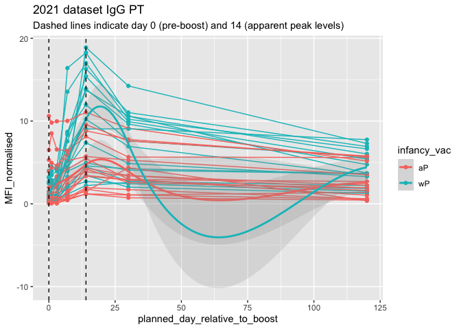
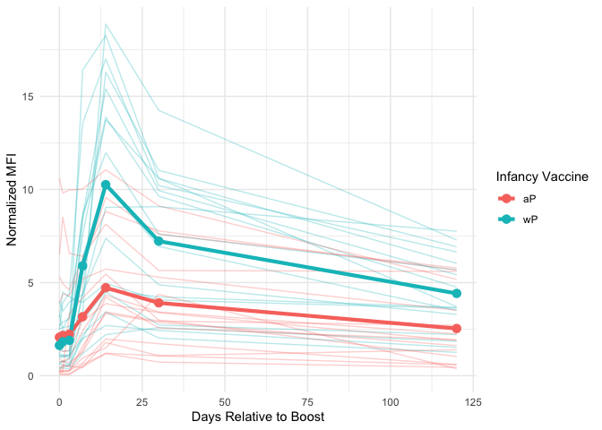

# Class 18: Mini Project Investigating Pertussis Resurgence
Katherine Quach (A18541014)

- [Background](#background)
- [CDC tracking data](#cdc-tracking-data)
- [Exploring CMI-PB data](#exploring-cmi-pb-data)

## Background

Pertussis (whooping cough) is a common lung infection caused by the
bacteria B. Pertussis. It can infect everyone but is most deadly for
infants (under 1 year of age)

## CDC tracking data

The CDC tracks the number of Pertussis cases:

> Q1. With the help of the R “addin” package datapasta assign the CDC
> pertussis case number data to a data frame called cdc and use ggplot
> to make a plot of cases numbers over time.

I want a plot of year vs. cases

``` r
library(ggplot2)

ggplot(cdc) +
  aes(year, cases) +
  geom_point() +
  geom_line()
```


> Q2. Using the ggplot geom_vline() function add lines to your previous
> plot for the 1946 introduction of the wP vaccine and the 1996 switch
> to aP vaccine (see example in the hint below). What do you notice?

Add annotation lines for the major milestones of wP vaccination roll-out
(1946) and the switch to the aP vaccine (1996).

After adding the vertical lines, the pattern shows that pertussis cases
plummet sharply and remain extremely low for decades following the
rollout of the wP vaccine. However, after the transition to the aP
vaccine, the long period of stability shows a gradual resurgence, with
increases and periodic outbreaks in the 2000s and 2010s. The lines make
it much more clear that the wP era corresponds to the most dramatic and
sustained reduction in disease burden, while the aP era corresponds to
aslow but persistent upward trend in cases.

``` r
library(ggplot2)

ggplot(cdc) +
  aes(year, cases) +
  geom_point() +
  geom_line() +
  geom_vline(xintercept = 1946, col = "blue", lty = 2)+
  geom_vline(xintercept = 1996, col = "red", lty = 2) + 
  geom_vline(xintercept = 2020, col = "grey", lty = 2)
```


> Q3. Describe what happened after the introduction of the aP vaccine?
> Do you have a possible explanation for the observed trend?

It is clear from the CDC data that pertussis cases are once again
increasing. For example, we can see that in 2012 the CDC reported 48,277
cases of pertussis in the United States. This is the largest number of
cases reported since 1955, when 62,786 cases were reported. The
pertussis field has several hypotheses for the resurgence of pertussis
including (in no particular order): 1) more sensitive PCR-based testing,
2) vaccination hesitancy 3) bacterial evolution (escape from vaccine
immunity), 4) waning of immunity in adolescents originally primed as
infants with the newer aP vaccine as compared to the older wP vaccine.

## Exploring CMI-PB data

The CMI-PB project \< https://www.cmi-pb.org \> mission is to provide
the scientific immunity with a comprehensive, high-quality and freely
accessible resource of Pertussis booster vaccination

Basically, make available a large data set on the immune response to
Pertussis. They use a “booster” vaccination as a proxy for Pertussis
vaccination

They make their data available as JSON format API. We can read this into
R with the `read_json()` function from the **jsonlite** package:

``` r
library(jsonlite)

subject <- read_json("https://www.cmi-pb.org/api/v5_1/subject", simplifyVector = TRUE)
head(subject)
```

      subject_id infancy_vac biological_sex              ethnicity  race
    1          1          wP         Female Not Hispanic or Latino White
    2          2          wP         Female Not Hispanic or Latino White
    3          3          wP         Female                Unknown White
    4          4          wP           Male Not Hispanic or Latino Asian
    5          5          wP           Male Not Hispanic or Latino Asian
    6          6          wP         Female Not Hispanic or Latino White
      year_of_birth date_of_boost      dataset
    1    1986-01-01    2016-09-12 2020_dataset
    2    1968-01-01    2019-01-28 2020_dataset
    3    1983-01-01    2016-10-10 2020_dataset
    4    1988-01-01    2016-08-29 2020_dataset
    5    1991-01-01    2016-08-29 2020_dataset
    6    1988-01-01    2016-10-10 2020_dataset

> Q4. How many aP and wP individuals are in this `subject` table?

``` r
table(subject$infancy_vac)
```


    aP wP 
    87 85 

> Q5. How many Male and Female subjects/patients are in the dataset?

``` r
table(subject$biological_sex)
```


    Female   Male 
       112     60 

> Q6. What is the breakdown of `biological_gender` and `race`?

Is this representative of the US population?

``` r
table(subject$race, subject$biological_sex)
```

                                               
                                                Female Male
      American Indian/Alaska Native                  0    1
      Asian                                         32   12
      Black or African American                      2    3
      More Than One Race                            15    4
      Native Hawaiian or Other Pacific Islander      1    1
      Unknown or Not Reported                       14    7
      White                                         48   32

We can read more tables from the CMI-PB database

``` r
specimen <- read_json("https://www.cmi-pb.org/api/v5_1/specimen", 
                      simplifyVector = TRUE)
ab_titter <- read_json("https://www.cmi-pb.org/api/v5_1/plasma_ab_titer", 
                       simplifyVector = TRUE)
```

``` r
head(specimen)
```

      specimen_id subject_id actual_day_relative_to_boost
    1           1          1                           -3
    2           2          1                            1
    3           3          1                            3
    4           4          1                            7
    5           5          1                           11
    6           6          1                           32
      planned_day_relative_to_boost specimen_type visit
    1                             0         Blood     1
    2                             1         Blood     2
    3                             3         Blood     3
    4                             7         Blood     4
    5                            14         Blood     5
    6                            30         Blood     6

``` r
head(ab_titter)
```

      specimen_id isotype is_antigen_specific antigen        MFI MFI_normalised
    1           1     IgE               FALSE   Total 1110.21154       2.493425
    2           1     IgE               FALSE   Total 2708.91616       2.493425
    3           1     IgG                TRUE      PT   68.56614       3.736992
    4           1     IgG                TRUE     PRN  332.12718       2.602350
    5           1     IgG                TRUE     FHA 1887.12263      34.050956
    6           1     IgE                TRUE     ACT    0.10000       1.000000
       unit lower_limit_of_detection
    1 UG/ML                 2.096133
    2 IU/ML                29.170000
    3 IU/ML                 0.530000
    4 IU/ML                 6.205949
    5 IU/ML                 4.679535
    6 IU/ML                 2.816431

To make sense of all this data, we need to “join” (a.k.a. “merge” or
“link”) all these tables together. Only then will you now that a given
Ab measurement (from the `ab_titter` table) was collected on a certain
date (from the `specimen` table) from a certain wP or aP subject (from
the `subject` table).

We can use **dplyr** and the `*_join()` family of functions to do this

``` r
library(dplyr)
```


    Attaching package: 'dplyr'

    The following objects are masked from 'package:stats':

        filter, lag

    The following objects are masked from 'package:base':

        intersect, setdiff, setequal, union

``` r
meta <- inner_join(subject, specimen)
```

    Joining with `by = join_by(subject_id)`

``` r
head(meta)
```

      subject_id infancy_vac biological_sex              ethnicity  race
    1          1          wP         Female Not Hispanic or Latino White
    2          1          wP         Female Not Hispanic or Latino White
    3          1          wP         Female Not Hispanic or Latino White
    4          1          wP         Female Not Hispanic or Latino White
    5          1          wP         Female Not Hispanic or Latino White
    6          1          wP         Female Not Hispanic or Latino White
      year_of_birth date_of_boost      dataset specimen_id
    1    1986-01-01    2016-09-12 2020_dataset           1
    2    1986-01-01    2016-09-12 2020_dataset           2
    3    1986-01-01    2016-09-12 2020_dataset           3
    4    1986-01-01    2016-09-12 2020_dataset           4
    5    1986-01-01    2016-09-12 2020_dataset           5
    6    1986-01-01    2016-09-12 2020_dataset           6
      actual_day_relative_to_boost planned_day_relative_to_boost specimen_type
    1                           -3                             0         Blood
    2                            1                             1         Blood
    3                            3                             3         Blood
    4                            7                             7         Blood
    5                           11                            14         Blood
    6                           32                            30         Blood
      visit
    1     1
    2     2
    3     3
    4     4
    5     5
    6     6

Let’s do one more `inner_join()` to join the `ab_titter` with all our
meta data

``` r
abdata <- inner_join(ab_titter, meta)
```

    Joining with `by = join_by(specimen_id)`

``` r
head(abdata)
```

      specimen_id isotype is_antigen_specific antigen        MFI MFI_normalised
    1           1     IgE               FALSE   Total 1110.21154       2.493425
    2           1     IgE               FALSE   Total 2708.91616       2.493425
    3           1     IgG                TRUE      PT   68.56614       3.736992
    4           1     IgG                TRUE     PRN  332.12718       2.602350
    5           1     IgG                TRUE     FHA 1887.12263      34.050956
    6           1     IgE                TRUE     ACT    0.10000       1.000000
       unit lower_limit_of_detection subject_id infancy_vac biological_sex
    1 UG/ML                 2.096133          1          wP         Female
    2 IU/ML                29.170000          1          wP         Female
    3 IU/ML                 0.530000          1          wP         Female
    4 IU/ML                 6.205949          1          wP         Female
    5 IU/ML                 4.679535          1          wP         Female
    6 IU/ML                 2.816431          1          wP         Female
                   ethnicity  race year_of_birth date_of_boost      dataset
    1 Not Hispanic or Latino White    1986-01-01    2016-09-12 2020_dataset
    2 Not Hispanic or Latino White    1986-01-01    2016-09-12 2020_dataset
    3 Not Hispanic or Latino White    1986-01-01    2016-09-12 2020_dataset
    4 Not Hispanic or Latino White    1986-01-01    2016-09-12 2020_dataset
    5 Not Hispanic or Latino White    1986-01-01    2016-09-12 2020_dataset
    6 Not Hispanic or Latino White    1986-01-01    2016-09-12 2020_dataset
      actual_day_relative_to_boost planned_day_relative_to_boost specimen_type
    1                           -3                             0         Blood
    2                           -3                             0         Blood
    3                           -3                             0         Blood
    4                           -3                             0         Blood
    5                           -3                             0         Blood
    6                           -3                             0         Blood
      visit
    1     1
    2     1
    3     1
    4     1
    5     1
    6     1

> Q11. How many specimens (i.e. entries in abdata) do we have for each
> isotype?

How many different Ab “isotypes” values are in this dataset?

``` r
table(abdata$isotype)
```


      IgE   IgG  IgG1  IgG2  IgG3  IgG4 
     6698  7265 11993 12000 12000 12000 

> Q12. What are the different \$dataset values in abdata and what do you
> notice about the number of rows for the most “recent” dataset?

How many different “antigen” values are measured?

``` r
table(abdata$antigen)
```


        ACT   BETV1      DT   FELD1     FHA  FIM2/3   LOLP1     LOS Measles     OVA 
       1970    1970    6318    1970    6712    6318    1970    1970    1970    6318 
        PD1     PRN      PT     PTM   Total      TT 
       1970    6712    6712    1970     788    6318 

Let’s focus on IgG isotype

``` r
igg <- abdata |> 
  filter(isotype =="IgG")
head(igg)
```

      specimen_id isotype is_antigen_specific antigen        MFI MFI_normalised
    1           1     IgG                TRUE      PT   68.56614       3.736992
    2           1     IgG                TRUE     PRN  332.12718       2.602350
    3           1     IgG                TRUE     FHA 1887.12263      34.050956
    4          19     IgG                TRUE      PT   20.11607       1.096366
    5          19     IgG                TRUE     PRN  976.67419       7.652635
    6          19     IgG                TRUE     FHA   60.76626       1.096457
       unit lower_limit_of_detection subject_id infancy_vac biological_sex
    1 IU/ML                 0.530000          1          wP         Female
    2 IU/ML                 6.205949          1          wP         Female
    3 IU/ML                 4.679535          1          wP         Female
    4 IU/ML                 0.530000          3          wP         Female
    5 IU/ML                 6.205949          3          wP         Female
    6 IU/ML                 4.679535          3          wP         Female
                   ethnicity  race year_of_birth date_of_boost      dataset
    1 Not Hispanic or Latino White    1986-01-01    2016-09-12 2020_dataset
    2 Not Hispanic or Latino White    1986-01-01    2016-09-12 2020_dataset
    3 Not Hispanic or Latino White    1986-01-01    2016-09-12 2020_dataset
    4                Unknown White    1983-01-01    2016-10-10 2020_dataset
    5                Unknown White    1983-01-01    2016-10-10 2020_dataset
    6                Unknown White    1983-01-01    2016-10-10 2020_dataset
      actual_day_relative_to_boost planned_day_relative_to_boost specimen_type
    1                           -3                             0         Blood
    2                           -3                             0         Blood
    3                           -3                             0         Blood
    4                           -3                             0         Blood
    5                           -3                             0         Blood
    6                           -3                             0         Blood
      visit
    1     1
    2     1
    3     1
    4     1
    5     1
    6     1

> Q13. Complete the following code to make a summary boxplot of Ab titer
> levels (MFI) for all antigens:

Make a plot of “MFI_normalized” values for all `antigen` values.

``` r
ggplot(igg) +
  aes(MFI_normalised, antigen) +
  geom_boxplot() +
  xlim(0, 75) +
  facet_wrap(vars(visit), nrow = 2)
```

    Warning: Removed 5 rows containing non-finite outside the scale range
    (`stat_boxplot()`).


``` r
ggplot(igg) +
  aes(MFI_normalised, antigen) +
  geom_boxplot()
```


> Q14. What antigens show differences in the level of IgG antibody
> titers recognizing them over time? Why these and not others?

The antigen “PT”, “FIM2/3”, “FHA”, and “PRN” appear to have the widest
range of values. “PT” levels rise sharply after vaccination, then wane
(time-dependent differences are expected). It’s also highly immunogenic
and tightly regulated in acellular pertussis vaccines. “FIM2/3” levels
are more on the variable side, especially in children. Some vaccines
include FIM antigens but others don’t, therefore time-dependent
differences often reflect vaccine composition. “FHA” shows strong
boosting responses after exposure or vaccination, and a major Bordetella
pertussis antigen, so IgG responses are known to vary with infection and
vaccination history. “PRN” is another key pertussis antigen with
boost-and-wane kinetics, therefore responses often differ between
individuals depending on exposure history and vaccin composition. These
antigens are components of acellular pertussis vaccines, so it makes
sense that their IgG levels would change over time with response to
vaccinations or natural exposure.

Antigens that show little or no difference in the level of IgG antibody
titers include “OVA”, “TT”, and “DT”. “OVA” is a control antigen that’s
not related to infection of vaccination, therefore IgG levels should
remain low and stable, therefore no time-dependent change is expected.
“TT” responses are long-lived and stable after childhood vaccination
unless a booster was given during the study window, therefore titers
here won’t shift much. “DT” levels are similar to “TT” in that they are
long-lasting immunity with slow waning and no major fluctuations unless
a booster is administered. These antigens are either controls or highly
stable vaccine antigens with long-term immunity, therefore naturally
showing less variation.

> Q. Is there a difference for these responses between aP and wP
> individuals?

``` r
ggplot(igg) +
  aes(MFI_normalised, antigen, col=infancy_vac) +
  geom_boxplot() 
```


``` r
library(ggplot2)

ggplot(igg) +
  aes(MFI_normalised, antigen) +
  geom_boxplot() +
  facet_wrap(~infancy_vac)
```


Is there a difference with time (i.e. before booster shoot vs after
booster shot)

``` r
ggplot(igg) +
  aes(MFI_normalised, antigen, col=infancy_vac) +
  geom_boxplot() +
  facet_wrap(~visit)
```


Lets finish this section by looking at the 2021 dataset IgG PT antigen
levels time-course:

``` r
## Filter to 2021 dataset, IgG and PT only
ab.PT.21 <- abdata |> filter(dataset == "2021_dataset",
                              isotype == "IgG",  
                             antigen == "PT")

  ggplot(ab.PT.21) +
    aes(x=planned_day_relative_to_boost,
        y=MFI_normalised,
        col=infancy_vac,
        group=subject_id) +
    geom_point() +
    geom_line() +
    geom_smooth(aes(group = infancy_vac), 
                alpha = 0.2) +
    geom_vline(xintercept=0, linetype="dashed") +
    geom_vline(xintercept=14, linetype="dashed") +
  labs(title="2021 dataset IgG PT",
       subtitle = "Dashed lines indicate day 0 (pre-boost) and 14 (apparent peak levels)")
```

    `geom_smooth()` using method = 'loess' and formula = 'y ~ x'



``` r
trajectory_data <- ab.PT.21 %>%
  group_by(infancy_vac, planned_day_relative_to_boost) %>%
  summarise(mean_MFI = mean(MFI_normalised, na.rm = TRUE))
```

    `summarise()` has regrouped the output.
    ℹ Summaries were computed grouped by infancy_vac and
      planned_day_relative_to_boost.
    ℹ Output is grouped by infancy_vac.
    ℹ Use `summarise(.groups = "drop_last")` to silence this message.
    ℹ Use `summarise(.by = c(infancy_vac, planned_day_relative_to_boost))` for
      per-operation grouping (`?dplyr::dplyr_by`) instead.

``` r
ggplot() +

  # individual subjects
  geom_line(data = ab.PT.21,
            aes(x = planned_day_relative_to_boost,
                y = MFI_normalised,
                group = subject_id,
                color = infancy_vac),
            alpha = 0.3) +

  # mean trajectory
  geom_line(data = trajectory_data,
            aes(x = planned_day_relative_to_boost,
                y = mean_MFI,
                color = infancy_vac,
                group = infancy_vac),
            size = 1.5) +

  geom_point(data = trajectory_data,
             aes(x = planned_day_relative_to_boost,
                 y = mean_MFI,
                 color = infancy_vac),
             size = 3) +

  labs(x = "Days Relative to Boost",
       y = "Normalized MFI",
       color = "Infancy Vaccine") +

  theme_minimal()
```

    Warning: Using `size` aesthetic for lines was deprecated in ggplot2 3.4.0.
    ℹ Please use `linewidth` instead.


